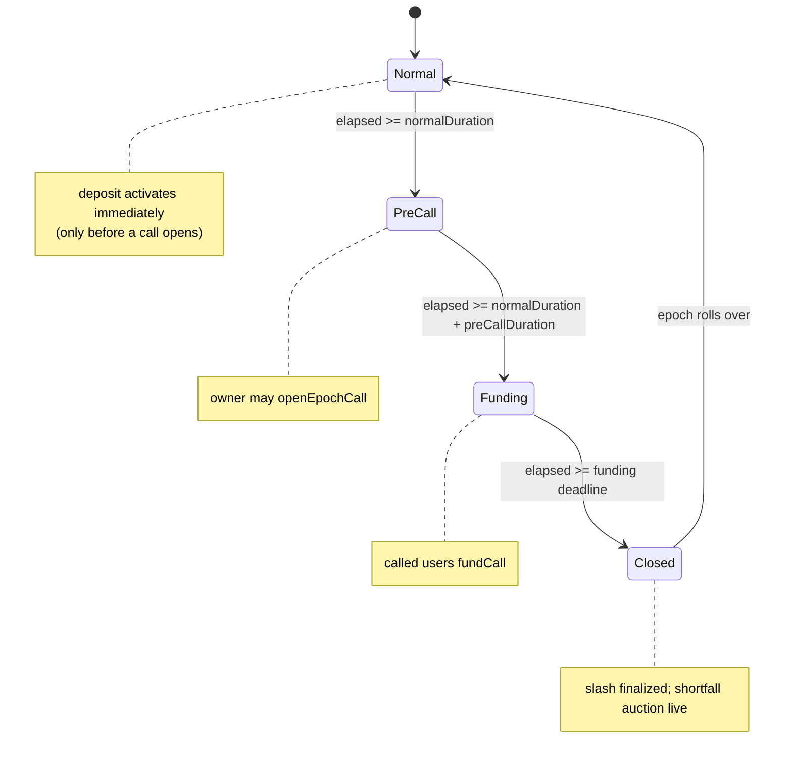
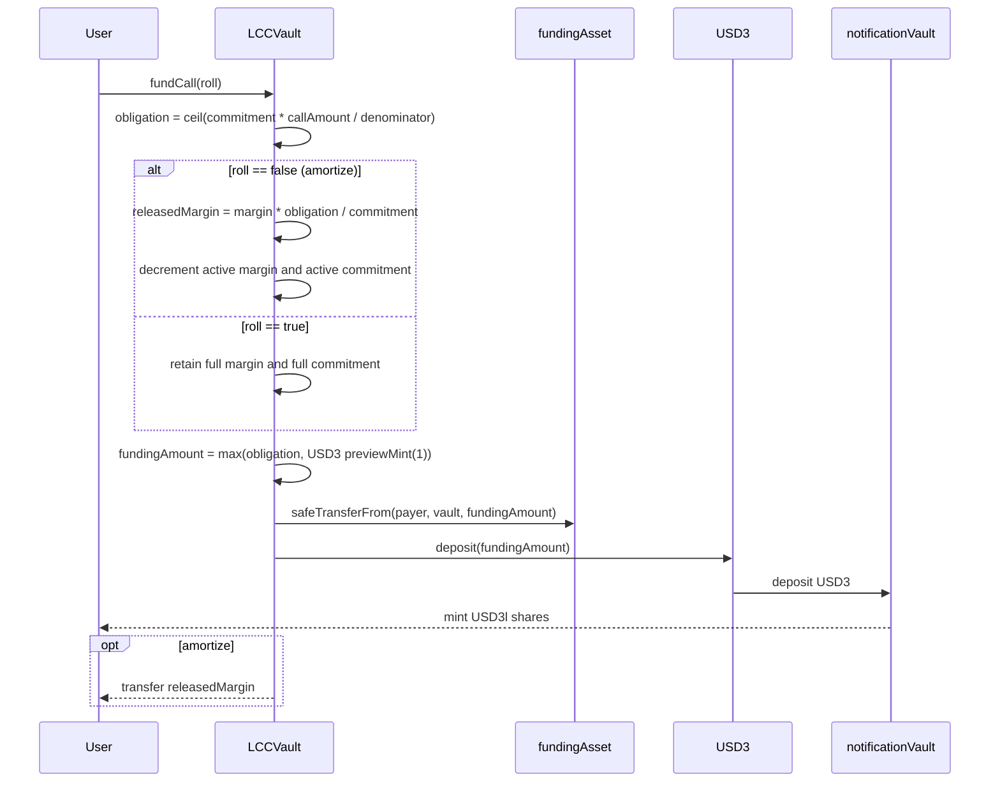
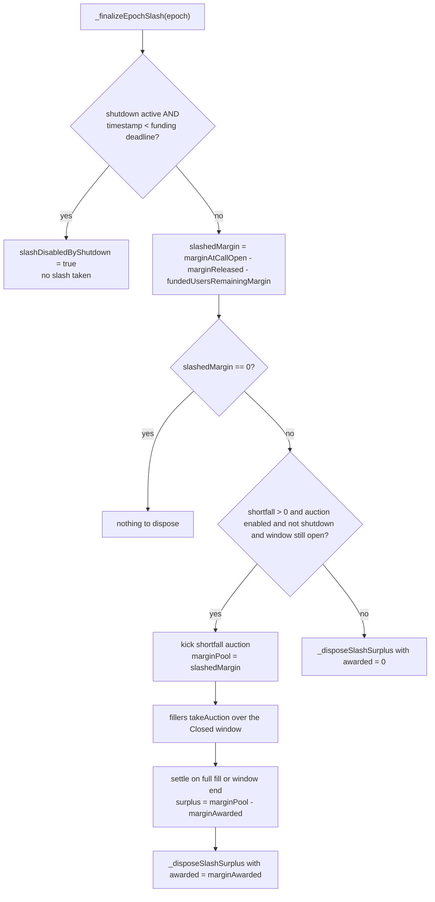
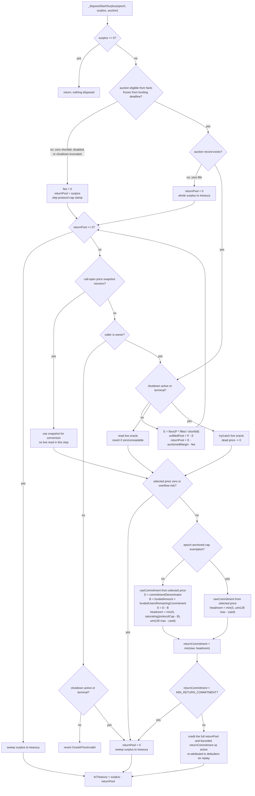
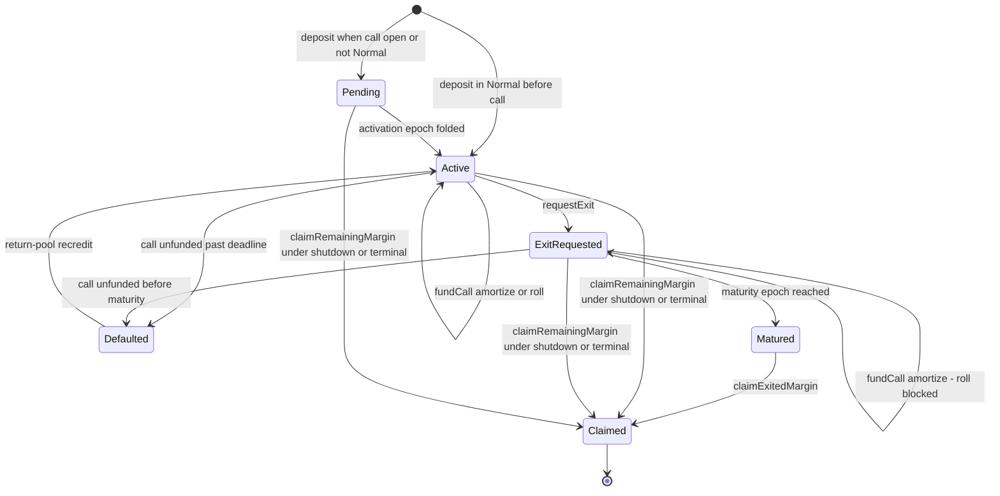
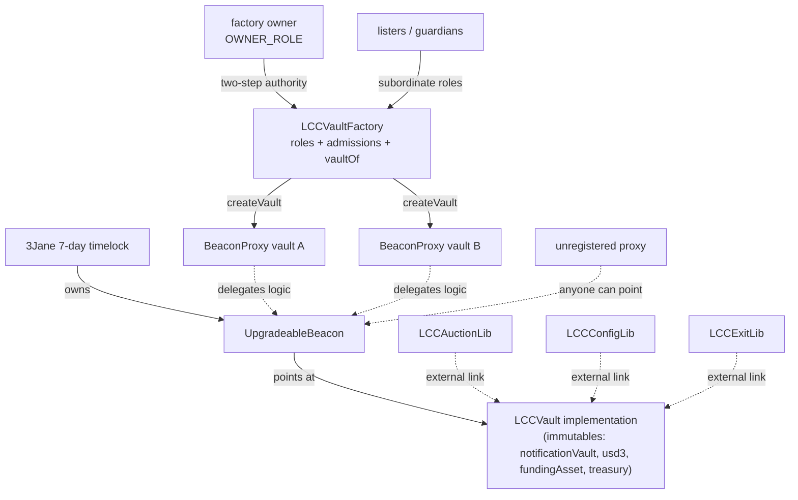

# LCC Vault — Leveraged Callable Credit

This is the mechanics deep-dive for the `src/lcc/` module, written for auditors. It teaches the epoch phases,
the funding and slashing flows, and the accounting invariants, with diagrams as the centerpiece. Every function,
field, and constant named here is a backticked identifier that resolves in the code. For the per-function API
contract read the NatSpec in [`interfaces/ILCCVault.sol`](interfaces/ILCCVault.sol); for the terse repo-wide map
and the upgrade checklist of record read [`docs/architecture.md`](../../docs/architecture.md).

## 1. What an LCC facility is

An LCC vault is a per-facility callable-credit primitive. It is **not** an ERC-4626 vault and it mints **no
transferable shares**. A depositor posts one ERC20 `marginAsset` as a performance bond. The vault values that bond
through a trusted oracle and leverages the value into a callable commitment denominated in `fundingAsset`:

```
marginValue = assets * price / ORACLE_PRICE_SCALE      // margin valued in fundingAsset
commitment  = marginValue * BPS / marginRatioBps       // leveraged callable commitment
```

`ORACLE_PRICE_SCALE` is `1e36` and `BPS` is `10_000`. With `marginRatioBps = 2000` the leverage is `BPS / 2000 = 5x`.

The factory owner opens at most one **capital call** per epoch. Each account with active commitment then owes a
ceil-rounded pro-rata slice of the call, funded **all-or-nothing** during the Funding phase; the funded amount is
delivered to the funder as wrapped USD3l (USDC routed through USD3 into the notification vault). An account that
does not meet its obligation by the funding deadline has its margin slashed into the epoch pool, and the resulting
call shortfall is offered through a step-decay auction. The treasury receives `slashFeeBps` of the take basis plus
the unfilled share of every auction-eligible epoch after its full window, including an untouched epoch with no
auction record. Any remainder is re-credited to defaulters at the call-open price as re-armed margin and callable
commitment, never as withdrawable cash.

**Unit convention** (from the `ILCCVault` header). Amount-like accounting values outside the margin family are
denominated in `fundingAsset` unless documented otherwise. Margin amounts are in `marginAsset`. `marginValue` is
margin valued in `fundingAsset`. `*Bps` fields are basis points out of `BPS`. Epoch fields are epoch indices.

**Spec-vocabulary mapping.** The spec term "callable asset" maps to `fundingAsset` in code, because that token
funds calls and auction fills. The worked examples below use symbolic round numbers (in whole `fundingAsset` /
`marginAsset` units, i.e. scaled by each token's decimals), not raw base units.

## 2. File map

| File                             | Responsibility                                                            |
| -------------------------------- | ------------------------------------------------------------------------- |
| `LCCVault.sol`                   | The vault: clock, deposits, calls, funding, lazy sync, slash, auction     |
| `LCCVaultFactory.sol`            | Family roles, deposit admission/registry, and `BeaconProxy` deployment    |
| `interfaces/ILCCVault.sol`       | External API, structs, and per-function NatSpec (the API reference)       |
| `libraries/LCCAuctionLib.sol`    | Stateless auction pricing math; externally linked into the implementation |
| `libraries/LCCConfigLib.sol`     | Externally linked validation and derived auction step duration            |
| `libraries/LCCExitLib.sol`       | Externally linked exit assignment and frozen exposure reconciliation      |
| `libraries/LCCAccountLib.sol`    | Pure in-memory account transitions (activate, mature, default, clear)     |
| `libraries/LCCBucketListLib.sol` | Sparse epoch-keyed bucket lists with swap-remove and 1-based index maps   |
| `libraries/LCCTypesLib.sol`      | Packed storage structs (upgrade-frozen layout)                            |
| `libraries/LCCErrorsLib.sol`     | Error selectors                                                           |
| `libraries/LCCEventsLib.sol`     | Event definitions                                                         |

Test suite in `test/forge/lcc/` maps to mechanics: `LCCDeposit` (deposits, activation, caps), `LCCCall` (open
call), `LCCFunding` / `LCCRoll` (amortize vs roll), `LCCSlash` / `LCCSlashFee` (slash and fee clamp), `LCCAuction`
(auction takes) / `LCCAuctionLib` (pricing-math unit tests), `LCCReturnPool` (surplus disposal), `LCCExit` /
`LCCMinCommitment` (exits and the commitment gate), `LCCTerminal` / `LCCShutdown` (wind-down), `LCCMaterialize` /
`LCCSync` (lazy replay), `LCCInvariant` (stateful harness), `LCCProxy` / `LCCFactory` (deployment topology), all
over the shared `LCCBase` harness.

## 3. Actors and trust model

- **Factory owner** — fully trusted family-wide. Opens calls (`openEpochCall`), tunes mutable risk caps
  (`setRiskCaps`, `setMaxAuctionAwardBps`, `setSlashFeeBps`, `setMarginOracle`), manages subordinate roles, can
  pause/unpause, and can trigger `shutdown`. Two-step factory ownership transfer re-keys every vault; owner-role
  renunciation is blocked, and the deliberately unheld default admin prevents minting additional owners.
  `setMarginOracle` is an
  owner-trusted rotation that reprices subsequent deposits and auction fill awards but not the price used to convert
  an opened call's remaining return pool. While paused the owner may rotate even a responsive oracle because no fills can execute. While
  unpaused, rotation is blocked during a live auction only while the current oracle still prices fills, so a
  zero-price or reverting oracle never blocks recovery; the new oracle must return a nonzero
  `marginAsset`-to-`fundingAsset` price at `ORACLE_PRICE_SCALE`. The owner controls the call size; a dust-sized
  `callAmount` can force every account to owe a single funding unit (see §7), a documented owner surface.
  `setRiskCaps` freezes every `protocolCommitmentCap` change while an auction is live because settlement reads that
  cap; the other risk fields remain mutable when the protocol cap is unchanged. Do not rotate factory ownership
  while any family vault has a pending auction slot with a missing price snapshot: both oracle repair and the
  recovering owner-triggered sync must remain under one owner.
- **Factory guardian** — `GUARDIAN_ROLE` circuit-breaker account. A guardian may pause any family vault but cannot
  unpause and cannot change configuration.
- **Lister** — `LISTER_ROLE` account that batch-manages the family depositor whitelist.
- **Bouncer** — `BOUNCER_ROLE` account that may reduce active commitment and return its paired active margin. Bounce
  is a trusted instant-exit valve that bypasses `exitDelayEpochs`, `exitCapBps` bucket capacity, and
  `minCommitmentEpochs`.
- **Deposit operator** — `DEPOSIT_OPERATOR_ROLE` payer allowed to fund margin irrevocably credited to another
  beneficiary. Grant only to a consent-verifying adapter, a closed facility operator with a documented consent
  channel, or a self-service adapter that hard-binds the beneficiary to `msg.sender` and has no delegated or generic
  call surface; never grant it to a generic arbitrary-calldata router. The role holder can otherwise refresh
  beneficiary lockups, consume cap headroom, and stage pending deposits that block exits and bounce remediation.
- **Admissions module** — optional narrow view-only decision hook for first deposits and closed-account reopens. It
  cannot write factory registry or role state, and it does not re-check top-ups in the currently registered open vault.
- **Margin oracle** — fully trusted. Returns a fresh `marginAsset`-to-`fundingAsset` price scaled by
  `ORACLE_PRICE_SCALE`, absorbing any token-decimal conversion. Deposits, call-open snapshots, and auction fills
  reject a zero price (`OraclePriceInvalid`).
- **Depositor / funder** — posts margin, funds its own obligation (`fundCall(bool)`), and exits (`requestExit`).
- **Push funder** — funds another account's obligation with `fundCall(address)`; always amortizes.
- **Auction filler** — fills an epoch's shortfall via `takeAuction` for wrapped USD3l plus a collateral kicker.
- **Treasury** — protocol-wide recipient of slashed margin and unsold auction collateral. Immutable.
- **Beacon owner** — 3Jane's 7-day timelock; can replace logic under every beacon-backed vault after the delay.

Operational requirements: the `marginAsset` must be a standard ERC20 (fee-on-transfer or rebasing tokens break
margin conservation), and each vault must be on USD3's `supplyCapExempt` list so funding and fill deposits bypass
supply-cap headroom and first-time minimums. A zero USD3 supply cap takes precedence over that exemption and blocks
all deposits as an emergency pause.

### Accepted risk: feedless par treatment

The four new margin oracles deliberately set every base and quote feed slot to the zero address and therefore price
only the ERC-4626 share-conversion rate. For waEthUSDC this is identity treatment because the underlying is USDC. For
waEthUSDT, sUSDS, and sGHO it is a genuine assumption that USDT, USDS, and GHO respectively equal one USDC. A depeg
in any assumed-par asset is invisible to the oracle: deposits mint leverage-amplified commitment from the overstated
margin value, and `openEpochCall` freezes that value into the call-open snapshot. GHO is the weakest case.

This is an **ACCEPTED RISK**, not a mitigated or resolved one. The response is reactive: use `bounceCommitment`
(`LCCVault.sol:568-605`) or reduce the commitment fee. Bounce reverts while an auction slot is pending
(`LCCVault.sol:575`) and while a call is open but not slash-finalized (`LCCVault.sol:577`), so per-facility commitment
caps must be sized against a full-depeg scenario rather than par. Every margin-oracle change is an M-02 revalidation
trigger.

The limited structural reason this treatment is tolerable is that the LCC oracle sizes commitment relative to
margin; it is not a settlement rate at which one asset can be withdrawn for another. The only site touching an
actual asset exchange is the auction fill cap: `oracleCapMargin` is one ceiling among several in `fillAward`
(`libraries/LCCAuctionLib.sol:150-154`), while the step-decay `offered` curve sets the price the filler actually pays.
A genuine sustained depeg in USDT, USDS, or GHO re-arms the accepted exposure. A future change that makes the oracle
determine an asset-for-asset settlement rate would separately re-arm the structural concern.

### Factory-family authority and registry

`LCCVaultFactory` is the non-upgradeable authority root for the whole family as well as its admission registry and
proxy deployer. The deliberately unheld `DEFAULT_ADMIN_ROLE` prevents direct owner-role grants: two-step
`transferOwnership` / `acceptOwnership` is the only `OWNER_ROLE` mutation path, and owner renunciation is blocked. A
zero-address proposal cancels a pending transfer; proposing the current owner displaces a stale pending owner and can
be accepted without changing role membership.
Integrators should verify a candidate vault through `factory.isVault(vault)`, which is the exact provenance check.
There is deliberately no `factory()` getter within the tight vault runtime budget, and slot 29 is upgrade-layout
documentation rather than an integration API.
The owner administers `LISTER_ROLE`, `BOUNCER_ROLE`, `GUARDIAN_ROLE`, and `DEPOSIT_OPERATOR_ROLE`. Vaults read
emergency and settlement authority only through the factory-local `isOwner`, `isGuardian`, and `isBouncer` views;
those functions never consult an admissions module or another external contract. The factory also exposes the same
local, constant-time `isDepositOperator` role view for integrators, while production enforcement occurs inside
`authorizeDeposit` and no settlement path reads it. A family ownership rotation therefore changes authority and
exceptional settlement recovery for every vault at once.

Deposits are whitelisted and prospectively limited to one open family vault by default. Every beneficiary passes the
same whitelist, one-vault, and admissions checks. A self-deposit needs no operator role; when payer and beneficiary
differ, the payer must hold `DEPOSIT_OPERATOR_ROLE`, and that role check precedes the same-vault top-up short-circuit.
The payer is deliberately not checked against the depositor whitelist. The factory records the beneficiary's last
authorized vault in `vaultOf`; a deposit elsewhere can lazily repoint only after bounded replay completes and reports
zero exposure. Admission checks only the vault currently named by `vaultOf`; it never scans the unbounded family list.
An incomplete replay of that named vault is conservatively open, and a matured exit remains open until
`claimExitedMargin`. The whitelist applies to every deposit. The optional admissions module applies to first deposits,
reopens, and cross-pointer admissions, but a top-up in the currently registered open vault bypasses it. The owner may
independently disable whitelist or one-vault enforcement. While the one-vault policy is off, last-deposit recording
remains warm but no exclusivity invariant is claimed; under nested deposits, the outermost successful frame writes
last. Re-enabling is prospective and does not close or repair positions opened during the disabled interval.

There are two deliberate owner-accepted registry residuals. First, disabling the one-vault rule permits multiple open
positions and re-enabling is prospective only. Second, a user who opened positions in A and then B while the policy
was off has `vaultOf` pointing at B even while A remains open. If the policy is re-enabled, the user closes B, and
then reopens B, the named-vault check sees B as closed and does not discover the displaced position in A. Both are
bounded to users grandfathered by a policy-off window and are unreachable when the user's entire deposit history
occurred under an enabled policy. They are accepted in preference to an unbounded per-deposit scan that calls bounded
replay on every family vault. Before re-enabling, reconcile all multi-vault users offchain and verify no family vault
is paused or shut with unclaimable positions, because the latest recorded vault controls the named check and future
top-ups. Registry migration never needs an admin clear: close in A, then the next successful deposit in B re-points
automatically. Matured exiters must claim before the closure predicate can free their slot.

### Configuration parameters

Every `VaultParams` field is validated by `LCCConfigLib.validate` at `initialize`. Mutable fields are re-validated
by their own setter: `setRiskCaps` re-checks `protocolCommitmentCap`, `userCommitmentCap`, `exitCapBps`, and
`minDepositAssets`; `maxAuctionAwardBps` and `slashFeeBps` each have a dedicated setter (`setMaxAuctionAwardBps`,
`setSlashFeeBps`) with their own guards — both reject a nonzero value on an auction-disabled vault (`InvalidParams`)
and revert `InvalidPhase` while an auction is live. `setRiskCaps` likewise rejects any protocol-cap change during a
live auction, while permitting changes to its other fields if the protocol cap stays fixed.

**Change these before the funding deadline.** All three setters are `synced`, and `_syncGlobal` runs before the
setter body — so once the deadline has passed, the setter's own call can finalize the slash and open the auction
slot, and then revert `InvalidPhase` against the slot it just created. The auction is deliberately not disableable
once its window has opened; treat `maxAuctionAwardBps` and `slashFeeBps` as pre-deadline controls and land any
change while the epoch is still in `Funding` or earlier.

| Field                     | Meaning                                                                  | Validation bound                                     |
| ------------------------- | ------------------------------------------------------------------------ | ---------------------------------------------------- |
| `marginAsset`             | ERC20 performance bond                                                   | non-zero; must be standard ERC20                     |
| `marginOracle`            | Margin-to-funding price oracle                                           | non-zero                                             |
| `startTimestamp`          | Epoch-zero start                                                         | `<= type(uint64).max`                                |
| `maxEpochs`               | Callable epoch count; `0` = perpetual                                    | `<= type(uint64).max`                                |
| `epochLength`             | Total epoch seconds                                                      | non-zero; `<= type(uint32).max`                      |
| `normalDuration`          | Normal phase seconds                                                     | non-zero; `<= type(uint32).max`                      |
| `preCallDuration`         | PreCall phase seconds                                                    | non-zero; `<= type(uint32).max`                      |
| `fundingDuration`         | Funding phase seconds                                                    | non-zero; sum of three phases `<= epochLength`       |
| `marginRatioBps`          | Leverage: `commitment = marginValue * BPS / marginRatioBps`              | `> 0` and `<= BPS`                                   |
| `protocolCommitmentCap`   | Vault-wide active+pending commitment cap (mutable: setRiskCaps)          | `> 0` and `<= type(uint128).max`                     |
| `userCommitmentCap`       | Per-account commitment cap (mutable: setRiskCaps)                        | `> 0` (no width bound)                               |
| `exitCapBps`              | Exit capacity fraction of max(configured cap, live active commitment)    | `>= MIN_EXIT_CAP_BPS` (313) and `<= BPS`             |
| `exitDelayEpochs`         | Min epochs from a Normal-phase request to earliest maturity              | `> 0` and `<= 64` (`MAX_EXIT_DELAY_EPOCHS`)          |
| `minCommitmentEpochs`     | Min committed epochs before an exit request; `0` disables                | `<= 64`                                              |
| `minDepositAssets`        | Minimum margin deposit (mutable: setRiskCaps)                            | none (may be `0`)                                    |
| `auctionStepCount`        | Price steps across the Closed window; `0` disables auction               | `0`, or `>= 2` and `<= epochLength - phaseDurations` |
| `auctionStepDecayRateBps` | Per-step retained-pool decay                                             | if enabled: `> 0` and `<= BPS`; if disabled: `0`     |
| `maxAuctionAwardBps`      | Oracle-valued award cap per unit filled (mutable: setMaxAuctionAwardBps) | `<= BPS`; if auction disabled: `0`                   |
| `slashFeeBps`             | Fee on the greater of awards and the pro-rata first-step offer (mutable: setSlashFeeBps) | `<= BPS`; if auction disabled: `0` |

`MIN_EXIT_CAP_BPS` is `(2 * BPS + 63) / 64 = 313`; it floors `exitCapBps` so full-cap honest exit demand plus the
maximum temporal spread fits inside the 128 maturity-bucket cap (§9). When `auctionStepCount == 0` the disposal path
still runs, but no collateral is ever awarded, so a nonzero decay, award cap, or slash fee is dead config and
rejected. Only `protocolCommitmentCap` carries the `uint128` width bound; `validate` enforces just `> 0` on
`userCommitmentCap`, which is transitively bounded below `uint128` because no account's active+pending commitment
can exceed the protocol cap.

## 4. Epoch clock and phase machine

Phases are **pure functions of the pause-adjusted effective timestamp**. Nothing transitions them; no keeper advances
them. `_currentEpoch` clamps to `0` before `startTimestamp` and is otherwise
`(effectiveTime - startTimestamp) / epochLength`, and `_phaseAt` maps the offset within the epoch to a `Phase`. The
`synced` modifier only catches **accounting** up to the effective clock (§5); it never changes which phase the clock
is in.



| Phase     | Ends at (`phaseEndsAt`)                                     | Phase-gated action                    | Revert if wrong phase |
| --------- | ----------------------------------------------------------- | ------------------------------------- | --------------------- |
| `Normal`  | `start + normalDuration`                                    | —                                     | —                     |
| `PreCall` | `start + normalDuration + preCallDuration`                  | `openEpochCall`                       | `InvalidPhase`        |
| `Funding` | `_fundingDeadline` (= `start + normal + preCall + funding`) | `fundCall(bool)`, `fundCall(address)` | `InvalidPhase`        |
| `Closed`  | `start + epochLength`                                       | `takeAuction` (auction must be live)  | `AuctionNotLive`      |

`phaseEndsAt` projects the queried effective-time boundary into wall-clock time using the pause offset accumulated at
the time of the query. It is exact for current and future boundaries while unpaused, but a boundary already in the
past shifts if a later pause adds to the offset. While paused, it reports the end as if the vault were unpaused at the
current wall clock, so every lifecycle window resumes with the same effective time remaining.

## 4.1 Pause circuit breaker

`pause()` is callable by the factory owner or any factory `GUARDIAN_ROLE` member. It freezes the derived clock and makes every `synced`
entrypoint revert before state progression, including deposits, exits, funding, auctions, slash finalization,
materialization, and synced owner setters. `shutdown`, `setMarginOracle`, pause/unpause, factory role management, and views
remain live so the owner can wind down or rotate an oracle during an incident. While paused, no auction fill can
execute, so the owner may replace even a still-responsive but compromised oracle before resuming; while unpaused,
the live-auction guard still permits recovery only when the old oracle is zero-price or reverting.

`unpause()` is owner-only and the pause has no time bound: margin stays frozen until the owner unpauses or shuts the
vault down, an accepted extension of the fully-trusted-owner model. Shutdown ends an active pause, emits `Unpaused`,
and immediately enables wind-down claims while recording the same frozen effective timestamp for slash semantics.
`pause()` remains callable after shutdown so a factory guardian or owner can stop a faulty wind-down claim path; the owner
must unpause again to resume claims. Each elapsed pause duration is accumulated into the clock offset, so all epochs,
funding deadlines, auction windows, exit maturities, and terminal checks shift by exactly the paused duration.

**Lifecycle-gated entrypoints:**

- `deposit(assets, minCommitment, maxCommitment, allowPendingActivation, deadline)` selects **immediate vs pending**
  activation: immediate only during `Normal` **and before a call has opened** for the current epoch, otherwise
  pending for epoch `e+1`. Pending deposits remain available during PreCall and while a call is unsettled; only a
  live auction blocks them. In every non-Normal phase, pending deposits require `allowPendingActivation = true`.
  The activation epoch must remain below scheduled sunset. `minCommitment` and `maxCommitment` inclusively bound the
  oracle-derived commitment, and `deadline` is checked against unadjusted wall-clock time so a pause does not extend
  freshness.
- `requestExit(maxDeferralEpochs, deadline)` has no phase check; it is gated by `VaultTerminal`,
  `DeadlineExpired`, `ExitInProgress`, `PendingDepositExists`, `InvalidAmount` (no active position),
  `CommitmentNotMature`, `ExitDeferralExceeded`, and `ExitCapacityReached`. A request after Normal is accepted but
  its earliest maturity moves one epoch later.
- `claimExitedMargin` / `claimRemainingMargin` have no phase check; they are gated by maturity, shutdown/terminal,
  and materialization lifecycle conditions.

`openEpochCall` also requires the epoch to be current (`InvalidEpoch`), no prior unsettled call
(`PriorCallUnsettled`), not already opened (`CallAlreadyOpened`), and `callAmount <= activeCommitment`.

## 5. Keeperless lazy sync

Every state-touching entrypoint runs the `synced` modifier, which calls `_syncGlobal`. The ordering is
load-bearing:


1. `_settleDueAuction` sweeps a live auction whose Closed window has passed (or once shutdown blocks takes), so a
   prior epoch's auction always settles before a new one can be kicked. Settlement disposes the auction's unawarded
   remainder through `_disposeSlashSurplus`, and that disposal's return-pool credit **increases** active totals via
   `_increaseGlobalActive(returnPool, returnCommitment)` (the same disposal path as §8 / Diagram C2).
2. The slash prefix is finalized in `calledEpochList` order: `_finalizeEpochSlash` runs for each leading called
   epoch that is slash-eligible, advancing `finalizedCallPrefix`. It stops at the first non-eligible epoch.
3. `_foldDueActivations` folds pending deposits whose activation epoch has arrived into active totals.
4. `_foldDueMaturities` folds matured exit buckets out of active totals.

**Slash before maturity folds** is intentional: finalizing a slash carves defaulted exiter exposure out of the exit
buckets (`_reduceExitBucketsForSlash`) before those buckets decrement global active totals, so a defaulted exiter's
exposure leaves the totals exactly once. Disposal's commitment bound is call-local and does not read exit buckets;
the ordering remains necessary for aggregate accounting.

**Per-account replay.** Account state is materialized on demand by replaying the sparse `calledEpochList` from each
account's `calledEpochCursor` (`_replayAccount`). A mutating replay is bounded to `MAX_MATERIALIZE_STEPS = 64`
finalized calls per call; an account further behind reverts `AccountMaterializationIncomplete` until the
permissionless `materializeAccount` advances it in batches. Replay also stops at an unfinalized epoch or at the live
auction epoch (the live-auction replay barrier), so exposure under an in-flight auction is never prematurely
resolved.

## 6. Deposits and commitment

`deposit` pulls `assets` of `marginAsset` from the caller and irrevocably credits the `onBehalfOf` beneficiary, then
reads the oracle and derives `commitment = marginValue * BPS / marginRatioBps`. Self-deposits pass the caller as the
beneficiary and need no operator role; a distinct payer must hold the factory's `DEPOSIT_OPERATOR_ROLE`. The caller
supplies inclusive nonzero `minCommitment` / `maxCommitment` bounds, an `allowPendingActivation` opt-in, and a
wall-clock `deadline`. Both caps are checked against active+pending totals: `protocolCommitmentCap` vault-wide and
`userCommitmentCap` on the beneficiary account (`CapExceeded`). Factory authorization runs last, so a rejection is
fail-late but atomically unwinds the margin pull, account writes, and event.

Activation follows `_depositActivation`: **immediate** (credited to `activeMargin` / `activeCommitment` now) only
when the phase is `Normal` and no call has opened for the current epoch; otherwise **pending** for epoch `e+1`,
tracked in `pendingMarginByActivationEpoch` / `pendingCommitmentByActivationEpoch` and folded in later by sync.
Those two ABI-compatible `uint256` getters read the halves of one packed `LCCTypesLib.Bucket` storage word.
Deposits can stage throughout PreCall and an unsettled call because post-snapshot commitments cannot affect the
call-local return bound. A live auction remains blocking because per-account replay halts at the live-auction epoch, so a deposit admitted
there could not be materialized, and because it keeps the finalized-but-undisposed window free of new pending
exposure. The auction's own collateral inventory is fixed at kick and is not the reason.

Every deposit advances `commitmentStartEpoch` to at least its activation epoch. A default that receives a nonzero
return-pool re-credit advances it to the later of its current value and `callEpoch + 1`, the first epoch in which
that re-credited exposure can back a new call. This starts a fresh `minCommitmentEpochs` period without allowing a
permissionless disposal delay to lengthen it; rounding-dropped credits leave the anchor unchanged. Funding of any
kind never touches `commitmentStartEpoch`.

### Static aToken deposit helper

`LCCMarginDepositHelper` lets a user wrap USDC, aEthUSDC, USDT, or aEthUSDT into the corresponding StataTokenV2
margin asset and deposit it atomically. Its four explicit entrypoints always pass `msg.sender` as the LCC beneficiary;
there is no receiver, `onBehalfOf`, `depositFor`, owner, upgrade, rescue, or generic-call surface. The helper therefore
needs the family-wide `DEPOSIT_OPERATOR_ROLE` because it pays the vault, but it cannot use that role to credit anyone
other than the transaction author. Factory registration and the vault's expected margin asset are checked before any
input token is pulled. User-supplied share and commitment bounds, pending-activation choice, and deadline are
forwarded to the matching vault.

Underlying-token paths respect the StataToken's finite `maxDeposit`; aToken paths use `depositATokens` and remain
available when the Aave underlying supply cap leaves no deposit headroom. Integrators should approve only the selected
input token and call the matching explicit entrypoint. The helper uses exact, per-call allowances and never reads its
own token balances: the vault deposit passes the share amount returned by `stata.deposit` / `stata.depositATokens`,
and both the wrap leg and the vault leg are bracketed by exact `forceApprove(spender, amount)` /
`forceApprove(spender, 0)` pairs, so the StataToken can pull at most `params.amountIn` and the vault at most the
shares just minted. Tokens force-transferred to the helper are ignored and unspendable through it.

## 7. Capital calls and funding

`openEpochCall` (PreCall only) reads a validated nonzero oracle price and stores it in
`marginPriceAtCallOpen[epoch]`, snapshots `commitmentDenominator = activeCommitment`, records `callAmount` and
`marginAtCallOpen`, exposes the price in `EpochCallOpened`, pushes the epoch onto `calledEpochList`, and snapshots
exit-bucket exposure for the call. A reverting oracle propagates and a zero price reverts `OraclePriceInvalid`, so
no legitimate call can record a missing price snapshot.

Each account's obligation is computed **independently** and **ceil-rounded** from the call-open snapshot:

```
obligation = ceil(activeCommitment * callAmount / commitmentDenominator)
```

Ceil rounding means the sum of obligations can exceed `callAmount` by up to `(number of funders - 1)` units of
dust. `callAmount` is the nominal pro-rata base, **not** a hard aggregate funding cap; the pool can settle slightly
above it. `obligationOf` returns `0` once the account has funded, the epoch is finalized, or no call is open.

Funding must mint at least one USD3 share. The vault computes
`fundingAmount = max(obligation, usd3.previewMint(1))` before writing settlement state and pulls that amount from the
payer. Any extra amount is delivered to the beneficiary as USD3l but does not alter obligation-denominated
settlement accounting. The extra pull is capped at `MAX_FUNDING_TOP_UP = 1_000` funding-asset base units;
`FundingTopUpExcessive` protects approvals if USD3 PPS jumps between a quote and execution. Payers should approve
`obligationOf(epoch, user) + 1_000` base units, or compute
`max(obligationOf(epoch, user), usd3.previewMint(1))` client-side. If a degenerate USD3 has zero assets with supply
outstanding, `previewMint(1) == 0` and funding reverts `FundingDeliveryImpossible`. Both
`FundingTopUpExcessive` (pathological PPS) and `FundingDeliveryImpossible` use the same incident path: pause to freeze
the deadline, then have the owner shut down before the frozen deadline so the call cannot slash and users can claim
remaining margin.



**Amortize** (`fundCall(false)`): the account pays its obligation, releases margin proportionally
(`releasedMargin = activeMargin * obligation / activeCommitment`, floor), and its callable commitment drops by the
obligation. Active totals decrease. **Roll** (`fundCall(true)`): the account pays the obligation, receives wrapped
USD3l, but retains its **full** margin and **full** callable commitment; exposure re-arms every epoch, its pro-rata
share of later calls grows as amortizers decay, and lifetime obligations are unbounded. A live exiter cannot roll
(`ExitInProgress`) but may still amortize.

**Push funding** (`fundCall(address user)`): the caller pays; released margin, USD3l, and funded status accrue to
`user`. Push funding **always amortizes** so the payer cannot keep the user's margin locked. A push fund can
front-run and deny a user's intended roll for that epoch; the user can restore commitment by re-depositing the
released margin.

### Table 1 — one call/funding/slash scenario

`marginRatioBps = 2000` (5x), oracle price `1.0` (so `marginValue = margin`), `callAmount = 800`,
`commitmentDenominator = 8003`. Three accounts:

| Account | Margin | Commitment | Obligation (ceil)          | Action                                              |
| ------- | ------ | ---------- | -------------------------- | --------------------------------------------------- |
| Alice   | 1000   | 5000       | `ceil(4000000/8003)` = 500 | amortize → releases `1000*500/5000` = 100 margin    |
| Bob     | 600    | 3000       | `ceil(2400000/8003)` = 300 | roll → pays 300, keeps 600 margin / 3000 commitment |
| Carol   | 0.6    | 3          | `ceil(2400/8003)` = 1      | default → full margin slashed                       |

Carol's fair share is `3*800/8003 = 0.2999`, ceil-rounded up to `1` — the dust unit that makes the obligation sum
`500 + 300 + 1 = 801`, one unit above `callAmount = 800`.

Slash identity at finalization (Carol unfunded):

```
slashedMargin = marginAtCallOpen - marginReleased - fundedUsersRemainingMargin
              = 1600.6           - 100            - (900 + 600)
              = 0.6                                              // Carol's entire margin, all-or-nothing
```

`marginReleased = 100` (Alice's amortized release; Bob rolled, releasing nothing).
`fundedUsersRemainingMargin = 900 + 600` (Alice's post-release margin and Bob's retained margin).

## 8. Default, slashing, auction, disposal

`_finalizeEpochSlash` runs once per called epoch (lazily on sync, or via permissionless `finalizeEpochSlash`).
Diagram C1 covers the slash and auction kick; Diagram C2 covers surplus disposal at the `_disposeSlashSurplus`
boundary.



**Slash-disable boundary.** `_finalizeEpochSlash` disables slashing whenever
`_shutdown.active && _shutdown.timestamp < _fundingDeadline(epoch)` — i.e. **any** shutdown strictly **before** the
epoch's funding deadline, which **includes** a shutdown landing during `PreCall` after the call has already opened,
not only one inside the `Funding` phase. At or after the deadline, defaults are final. (Note the asymmetry:
`_slashEligible` uses `<=` the deadline for eligibility, but the disable check is strict `<`, so a shutdown exactly
at the deadline is eligible **and** its defaults stand.)

An auction is kicked only when there is a shortfall (`callAmount > fundedAmount`), `maxAuctionAwardBps != 0`, the
vault is not shut down, and the epoch-end window is still open. Otherwise the slashed margin flows straight to
`_disposeSlashSurplus`. Economic eligibility is broader than record creation: a nonzero shortfall and award cap make
the epoch eligible unless shutdown was recorded strictly before its Closed end. An eligible late finalization with
no record is completed at zero fill, so its whole pool goes to treasury. Initializer and setter validation make a
nonzero award cap imply enabled auction machinery; settlement intentionally omits the redundant
`auctionStepCount != 0` check. `slashFeeBps == 0` does not disable eligibility.

`AuctionState` stores its four `uint128` counters in two words. `getAuctionState` keeps the historical wire encoding,
while the externally linked `LCCAuctionLib` computes and records each packed fill atomically.

### Auction pricing (Diagram D — formula + Table 2)

`takeAuction` follows Yearn-take semantics, filling `min(maxFillAmount, remainingShortfall)`. Callers bound the
execution-time kicker with `minMarginAward` and transaction inclusion with a wall-clock `deadline`; the deadline is
checked in the function body after the `synced` modifier has run. The offered collateral ramps over the Closed
window:

Unlike call funding, auction fills never pull above `maxFillAmount`. At USD3 PPS above 1, a fill that leaves a
residual smaller than `usd3.previewMint(1)` can make that residual unfillable because every later fill is clamped to
the remaining shortfall and mints zero shares. The residual settles through the existing window-end disposal path;
it does not roll over.

```
steps    = elapsed / stepDuration
retained = (1 - stepDecayRateBps/BPS) ^ steps        // rayMultiplier = RAY - stepDecayRateBps * 1e23
A_max    = marginPool * BPS / (BPS + slashFeeBps)    // award reserve; floors
offered  = A_max - A_max * retained / RAY             // ramps toward the reserved maximum award
award    = min( offered * fill / shortfall,           // ramped pro-rata of the ORIGINAL shortfall
                fill * maxAuctionAwardBps/BPS * ORACLE_PRICE_SCALE/price,   // oracle-valued cap
                A_max - marginAwarded,                // unawarded-reserve clamp
                floor(E_cum * BPS / (BPS + slashFeeBps)) - marginAwarded )
E_cum    = floor(marginPool * cumulativeFilled / shortfall)
```

The final cumulative clamp mirrors completed settlement's gross-eligible-pool flooring, keeping cumulative awards
within the fee-reserved share of `E_cum` even at base-unit dust. **Table 2** uses `marginPool = 100`,
`slashFeeBps = 0` (so `A_max = 100`), `stepDecayRateBps = 1000` (retained factor `0.9` per step), and
`auctionStepCount = 8`:

| Step | Retained `0.9^step` | Offered  | Live?                                                                                                |
| ---- | ------------------- | -------- | ---------------------------------------------------------------------------------------------------- |
| 0    | 1.0                 | 0        | yes (zero offer)                                                                                     |
| 1    | 0.9                 | 10       | yes                                                                                                  |
| 2    | 0.81                | 19       | yes                                                                                                  |
| 3    | 0.729               | 27.1     | yes                                                                                                  |
| 4    | 0.6561              | 34.39    | yes                                                                                                  |
| 5    | 0.59049             | 40.951   | yes                                                                                                  |
| 6    | 0.531441            | 46.8559  | yes                                                                                                  |
| 7    | 0.4782969           | 52.17031 | yes (max live offer in this example)                                                                 |
| 8    | 0.43046721          | 56.95328 | **no in this example — the window divides evenly, so the step-8 boundary coincides with settlement** |

The step index is `elapsed / auctionStepDuration`, uncapped, with `auctionStepDuration = closedWindow /
auctionStepCount` rounded down at configuration. When the Closed window divides evenly by the step count (as in this
table), takes are live strictly before epoch end, so reachable steps are `1..auctionStepCount-1` and the maximum live
offer is `A_max * (1 - (1 - decay)^(auctionStepCount-1))`. When it does not divide evenly, the flooring leaves a
remainder at the end of the window, so steps at and beyond `auctionStepCount` can be live before epoch end and the
offer keeps ramping along the same curve (a 10-second window with 6 steps gives 1-second steps and live steps up to
9). A one-step auction would offer zero for its entire window, which is why `auctionStepCount >= 2` is enforced. When
`maxAuctionAwardBps` binds, the oracle cap (row-independent) caps the award below the ramped offer regardless of how
far the curve has advanced.

### Surplus disposal (Diagram C2)



For an auction-eligible epoch with a record, `fee = min(feeBasis * slashFeeBps / BPS, surplus)`, where `feeBasis` is
the greater of the cumulative award and cumulative fills' pro-rata first-step offer. Only
`E = floor(P * filled / shortfall)` of gross pool `P` is eligible for return: `P - E` goes to treasury, and
`E - marginAwarded - fee` is the base return. An eligible zero-fill completion therefore sends all of `P` to
treasury even when lazy finalization never opened a record. A shutdown strictly before the Closed end genuinely
truncates the opportunity and returns all unawarded surplus without a fee; zero shortfall and disabled auctions use
the same no-take path. The selected `returnPool` is valued into a `returnCommitment` and re-attributed to defaulters
as active margin/commitment; the rest goes to treasury. On account replay, each defaulter is credited its full
floored pro-rata share of both the pool and the returned commitment.

Eligibility is classified from the epoch shortfall, the nonzero award cap, and the recorded shutdown timestamp: no
shutdown, or a shutdown at/after that epoch's Closed end, preserves eligibility. These facts are frozen from the
funding deadline because auction-config setters are `synced` and force-finalize any slash-eligible epoch before
mutating config; during that epoch's earlier Normal, PreCall, and Funding phases, a legitimate config change can
still change classification. Settlement therefore does not depend on touch order: kick-early then natural-end,
untouched late finalization, and finalization inside `shutdown()` after the window are identical at equal fill.
The per-user commitment cap deliberately does not bound this re-attribution (a knowing reopening of audit finding
M-01). The decision record, stated precisely:

- The credit approximates the call-open-price leveraged valuation of the account's returned margin, but
  `_pairedReturnPoolShare` floors the margin and commitment shares independently, so the realised
  commitment-per-margin ratio can exceed the pool ratio `returnCommitment / returnPool` — by less than a factor of
  `(marginShare + 1) / marginShare`, material only when the credited margin share is a handful of base units at an
  extreme oracle ratio. `LCCReturnPoolTest` pins a 1-wei margin share credited `750,000` commitment where the
  call-open valuation of that wei is `500,000` (50% excess). The aggregate credit never exceeds the epoch's
  `returnCommitment`.
- The aggregate is capped by the commitment the slash removed (the call-local headroom clamp), so a default→return
  cycle cannot increase `_totals.activeCommitment`; it only redistributes it among the epoch's defaulters, and
  crediting the full share keeps global totals equal to the sum of per-account commitments up to the pair-drop
  residual — O(1) flooring dust per epoch, except when the conversion pins at `MIN_RETURN_COMMITMENT`, where the
  residual scales with the dropped account's margin (`LCCPairDropOrphan.t.sol`).
- It is **not** bounded by the commitment slashed from that specific account. Price appreciation since the account's
  deposit basis, or a lower leverage basis than its co-defaulters (the accepted M-02 dispersion), can make the credit
  larger: `LCCReturnPoolTest` pins an account slashed for `50e18` commitment and credited `100e18`.
- Repeated default/return cycles cannot increase aggregate exposure. The headroom clamp caps each epoch's
  `returnCommitment` at the commitment the slash removed, so a rising call-open price pins the return at that
  commitment — never marked up to market — while a falling price marks it down and the clamp prevents marking it
  back up: aggregate commitment per unit of retained margin is monotone non-increasing across cycles
  (`LCCReturnPoolTest` walks a fixed all-defaulting cohort through consecutive cycles, flat and rising, and
  aggregate commitment never grows). An individual account exceeds its own slashed commitment only by absorbing
  co-defaulters' pro-rata share through the margin-keyed split above, bounded per epoch by the whole defaulter
  pool's slashed commitment; growth requires cohort composition change, not price appreciation alone. New deposits
  remain blocked above the cap, so `userCommitmentCap` is a one-directional admission gate, not an exposure bound.

**Price selection and cap wind-down.** The conversion step normally uses the validated oracle price frozen at call
open and does not consult the live oracle, whether or not the epoch is exempt from the cap clamp. This freezes only
the conversion price, not the amount converted: auction fills still use the live fill-time price to determine `marginAwarded`,
which is deducted from the pool and contributes to the fee basis alongside the cumulative fills' pro-rata first-step
offer. A zero snapshot is not reachable through a
legitimate call; it represents storage corruption or a future writer bug. In that exceptional state, a non-owner
intolerant touch reverts `OraclePriceInvalid`, while the owner may recover by triggering any synced action and using
the current live price. Price-failure tolerance follows actual shutdown or terminal state, independently of the
epoch-anchored cap exemption: an owner fallback is a direct read before tolerance applies and a try/catch read once
it does, while a non-owner tolerant touch treats the missing snapshot as zero. The predicates do not nest. The last
callable epoch disposed during its own Closed phase before terminal is cap-exempt but price-intolerant; with a corrupt
zero snapshot, a non-owner touch reverts until terminal begins one epoch later. If both the snapshot and live oracle
are dead, the owner must call `setMarginOracle` first and only then send the recovering `synced` call; `shutdown()`
alone is non-bricking but sweeps rather than recovers the pool. Let `D = commitmentDenominator`,
`B = fundedAmount + fundedUsersRemainingCommitment`, and `S = D - B`. Going-concern headroom is
`min(S, saturatingSub(protocolCommitmentCap, B), type(uint128).max - used)`, where `used` is current active plus
pending commitment only for the packed-width guard. The exact overflow predicate is applied unconditionally after
price selection as an oracle-corruption sweep, not a dead branch. Call opening validates only that the oracle price
is nonzero and stores it beside `marginAtCallOpen`; it does not multiply the two or prove that the snapshot can value
the margin without overflow. The later return pool is a subset, but that fact alone proves nothing about a price that
was never range-checked. Even for a full-`uint128` pool, the earliest overflow requires a selected price around
`3.4e70` at the minimum valid margin ratio — roughly 34 orders of magnitude above an honest
`ORACLE_PRICE_SCALE`-scaled price — so the guard is unreachable under the trusted-oracle assumption. On corrupt
state, un-gating the guard trades a permanent brick of every `synced` entrypoint for a confiscating sweep of the
whole selected pool, emitting the same zero-return disposal shape as a legitimate sweep. Preserve the ordering:
select the snapshot or fallback, apply the overflow guard, then retain the `price == 0` sweep. Cap-exempt disposal —
when shutdown was recorded strictly before the disposed epoch's Closed end, or when the disposed epoch is the last
callable epoch (or later) — uses
`min(S, type(uint128).max - used)`, omitting the protocol cap because no future call can use the returned
commitment. A positive commitment clamp retains the full recovered margin pool, producing a more-collateralized
return position; if the bounded commitment falls below
`MIN_RETURN_COMMITMENT` (`1e6` funding base units, i.e. `1.0` unit of a 6-decimal `fundingAsset`), both commitment
and pool are zeroed and the surplus is swept to treasury as dust.

Two subtleties carried in prose, not boxes:

- **Call-local base.** `D`, `fundedAmount`, and `fundedUsersRemainingCommitment` are fixed at call-open or accumulated
  only by funding, so deposits cannot influence the bound. `B` conservatively treats every funded account's
  call-open commitment as surviving: both a roller's and an amortizer's obligation plus recorded remainder equal
  its original commitment, while later exit folds can only reduce the real base. Reading the current
  `protocolCommitmentCap` is intentional so an owner cap reduction after call-open is honored.
- **Tight-cap zero.** For an auction-eligible epoch outside wind-down, a positive cap clamp preserves the full return
  pool. If the current cap is at or below `B`, headroom is zero, the paired return pool is zeroed, and the surplus goes
  to treasury. Auction-ineligible and wind-down disposal bypass this protocol-cap clamp. Heavy rolling can keep `B`
  high; owners manage the current cap with `setRiskCaps`, which freezes protocol-cap changes while the auction slot
  is live. Auction eligibility describes whether fillers had an auction opportunity, while this clamp protects
  future-call capacity. A kicked epoch can become ineligible when shutdown lands mid-window, but
  `shutdownTruncated` implies `windDown`, so the clamp condition already excludes it.

### Table 3 — disposal split

`slashedMargin` pool `= 100`, fully filled auction with `marginAwarded = 40`, disposed `surplus = 60`,
`slashFeeBps = 500` (5%), and `auctionStepDecayRateBps = 4000`, whose pro-rata first-step offer on a full fill is
about `38.1` and therefore below the cumulative award. With oracle price `1.0` and `marginRatioBps = 2000`,
`feeBasis = max(40, 38.1) = 40`, `fee = min(40 * 500/10000, 60) = 2`, pre-clamp `returnPool = 58`, and
`rawCommitment = returnPool * 5 = 290`.

| Headroom scenario               | returnCommitment | returnPool          | toTreasury               |
| ------------------------------- | ---------------- | ------------------- | ------------------------ |
| Headroom `>= 290` (no clamp)    | 290              | 58                  | `60 - 58` = 2 (fee only) |
| Headroom `= 100` (clamp)        | 100              | 58                  | `60 - 58` = 2 (fee only) |
| Dust (`returnCommitment < 1e6`) | 0 (swept)        | 0                   | 60 (entire surplus)      |

## 9. Exits

Exits are **full-account** and **irrevocable**. `requestExit` moves the whole active position into a maturity
bucket and assigns a maturity epoch, but the account **stays callable and slashable until maturity**.



**Commitment gate.** `requestExit` reverts `CommitmentNotMature` while
`currentEpoch < commitmentStartEpoch + minCommitmentEpochs`. The clock is anchored at the later of the account's
**latest deposit activation epoch** and **one epoch after the call that produced its latest nonzero return-pool
re-credit**. The latter is the first epoch in which the credit can back a new call, and is independent of when lazy
settlement runs. Every deposit and any such nonzero credit advances it monotonically, rounding-dropped credits leave
it unchanged, and no funding touches it.

**Maturity assignment.** `LCCExitLib.assignExitMaturity` is first-fit by request time (not strict FIFO). During Normal it
starts at `currentEpoch + exitDelayEpochs`. During PreCall, Funding, or Closed it starts one epoch later, at
`currentEpoch + exitDelayEpochs + 1`. Normal is the only phase before that epoch's call-opening window; Closed is
still part of the same epoch. While a call can still open — outside shutdown and before the last callable epoch's
call window has passed — the rule guarantees that **an accepted exit request spans at least one epoch whose call
outcome was unknown when the request was made**. At the shutdown or sunset edge, no prospective call exposure can be
manufactured, and `claimRemainingMargin` supplies the wind-down withdrawal path. The phase key is deliberately and
boundedly conservative for a request during PreCall before a call opens: the holder is already bound to that epoch's
still-unknown outcome, so the one-epoch shift buys no additional exposure, but keying only on `callOpened` would miss
the call-free Funding case. The configured delay therefore keeps its plain meaning for a holder who commits before
the current call window opens, while a later request costs one additional epoch.

From that phase-aware earliest maturity, assignment walks forward to the first bucket with room, where per-epoch
capacity is `max(1, max(protocolCommitmentCap, activeCommitment) * exitCapBps / BPS)`. Flooring the denominator at
aggregate live utilization is deliberately path-dependent. Capacity is recomputed for every request, so it is
never below the configured-cap value at that request, but it can decline as `activeCommitment` declines through
amortizing funding or slash finalization. `activeCommitment` is the aggregate and can include flooring-dust return
commitment not attributable to any account, which only widens capacity. Funded or slashed amounts free bucket room
retroactively. A request larger than the whole per-epoch capacity takes the first bucket with any remaining room.
During a live auction, capacity uses the post-slash trough before settlement restores return commitment, so a
non-defaulting exiter can be deferred farther than the same request just after settlement; this is a fairness and
UX artifact, not an accounting or fund-safety issue.

Per-bucket capacity is hard during normal first-fit assignment. Only when all 128 maturity-list keys are occupied
and first-fit would require a new key does assignment reuse an eligible tracked maturity and deliberately soften
that individual limit. Eligible keys lie within the caller's deferral window. Admission requires their scheduled
commitment plus the account to fit `N * C`, where `C` is the runtime per-bucket capacity and `N` is the eligible
tracked-key count. This is the only operative aggregate bound. Because total scheduled commitment plus the
requesting account cannot exceed the live commitment denominator, admission is unconditional once
`N >= ceil(BPS / exitCapBps)` (32 at `MIN_EXIT_CAP_BPS`), apart from base-unit flooring; the bound therefore has
teeth only for narrow deferral windows. The least-loaded eligible maturity wins, with the earliest breaking ties;
the account is never split. More precisely, let `S` be eligible scheduled commitment before the request and `A` be
the admitted account's actual commitment. The aggregate gate gives `S + A <= N * C`, while the minimum-load bucket
has at most `S / N`; its post-assignment load is therefore at most
`S / N + A <= C + A * (1 - 1 / N)`. Its overshoot beyond capacity is strictly less than `A`. The bound uses the
account's actual commitment, not the live `userCommitmentCap`, because return-pool replay can credit an account
above that admission cap. The rejected earliest-eligible alternative would have only the aggregate bound and could
concentrate an overshoot approaching `(N - 1) * C` in one bucket. Per-bucket smoothing is deliberately soft in this
full-list path.

The caller bounds that first-fit scan with `maxDeferralEpochs`: 0 accepts only the phase-aware earliest maturity,
`N` accepts up to `N` epochs past it, and `type(uint256).max` accepts any maturity. The one-epoch post-Normal shift
moves the entire caller-approved window uniformly; deferral is always measured from the shifted earliest and needs
no separate adjustment. The names separate two intervals: `exitDelayEpochs` is the Normal-request delay to the
earliest available maturity, while deferral starts where the phase-aware delay ends. The deferral bound is unrelated
to the `maxEpochs` sunset schedule. `deadline` is inclusive and uses unadjusted wall-clock time, so a pause cannot
extend transaction freshness. If both the caller's window and the 128-live-bucket limit would reject an exit,
`ExitDeferralExceeded` takes precedence.

Each maturity bucket stores its margin and commitment as the two `uint128` halves of one `LCCTypesLib.Bucket` word;
the original `exitBucketMarginByMaturity` and `exitBucketCommitmentByMaturity` getters still return `uint256`.
Per-call exit exposure similarly packs six `uint128` values into three words and keeps `listed` in a fourth word.
The explicit flag is the exact-once guard for `exitMaturitiesByCall` membership and must not be derived from amounts.

**Bucket-cap trio.** Live maturity keys are hard-capped at `MAX_EXIT_MATURITY_BUCKETS = 2 * 64 = 128`; a request
never creates a 129th key. When the full-list aggregate fallback cannot admit into an existing eligible key it
reverts `ExitCapacityReached`. `exitDelayEpochs <= 64` and `exitCapBps >= 313`
(`MIN_EXIT_CAP_BPS`) are enforced at config so worst-case honest exit demand — including first-fit fragmentation —
has enough aggregate scheduling room across reachable tracked keys. Scan termination instead relies on the runtime
capacity clamp: capacity is always at least one, so any empty bucket terminates the scan and only buckets with
nonzero commitment are skipped. Every bucket increase is tracked by `LCCExitLib.recordExitRequest`, every empty bucket is
removed by `_pruneExitMaturityIfEmpty`, and the live list is capped at 128, so first-fit reaches an empty key or the
aggregate fallback in at most 129 iterations. The limit remains reachable through cap-raise
sequences: each raise can restore deposit headroom and increase capacity, allowing an exact-capacity new account to
open the next maturity without fitting any prior nonempty bucket.

**Lockup arithmetic.** With `minCommitmentEpochs = 4`, `exitDelayEpochs = 2`, and a deposit activating at epoch `3`:

```
earliest request  = commitmentStartEpoch + minCommitmentEpochs = 3 + 4 = 7
Normal request maturity     = requestEpoch + exitDelayEpochs     = 7 + 2     = 9
post-Normal request maturity = requestEpoch + exitDelayEpochs + 1 = 7 + 2 + 1 = 10
```

Either earliest maturity can move later when its bucket is full under first-fit assignment.

`claimExitedMargin` pays the matured margin. A **fully-funded exiter** matures with nothing claimable but must
still call `claimExitedMargin` to clear the exit and make the account reusable (`clearExit`); otherwise it stays
`exitRequested` forever and can neither deposit nor re-exit.

## 10. Wind-down

The epoch-anchored protocol-cap exemption and live price-failure tolerance are separate, non-nesting decisions. For
example, the last callable epoch disposed during its own Closed phase before terminal is cap-exempt but still
price-intolerant. On every legitimately opened call, however, valuation bit 17 is inert: `openEpochCall` stores a
nonzero snapshot, the fallback and `OraclePriceInvalid` branches can inspect tolerance only when `price == 0`, and
the overflow guard is unconditional. The bit is monotone because shutdown and terminal are one-way and effective
time never rewinds across pause/unpause, so legitimate state has no tolerance-driven touch-order race.

The corrupt-state residual is different. If storage corruption or a future writer leaves a zero snapshot, before
terminal a non-owner reverts and preserves the pool for owner recovery. Once terminal flips by clock alone, the
first permissionless non-owner touch has oracle-fallback bit 16 clear, never reads the live oracle, and irreversibly
sweeps the pool to treasury; an owner touch at the same timestamp has bit 16 set and may use a healthy live oracle to
credit defaulters. Shipped code cannot create that zero snapshot, but an upgrade must not mistake the legitimate-state
inertness proof for a corrupt-state no-race guarantee.

**Emergency shutdown.** `shutdown` (owner-only) records `_shutdown` **before** its internal `_syncGlobal`, so
in-flight finalizations observe it. Its slash effect is the corrected boundary of §8: an epoch whose funding
deadline has **not** yet passed at the shutdown timestamp finalizes with slashing **disabled**
(`slashDisabledByShutdown`), so no margin is forfeited for calls that were still fundable when the vault froze;
epochs already past their deadline slash normally. Shutdown blocks new `deposit`, `openEpochCall`, and `takeAuction`,
and enables `claimRemainingMargin`. For the protocol-cap clamp, shutdown is wind-down only when its recorded
timestamp is strictly before the disposed epoch's Closed end; an epoch whose window already ended retains its
epoch-anchored clamp terms. Actual shutdown nevertheless makes exceptional price failure non-bricking for every
disposed epoch.

**Scheduled sunset.** When `maxEpochs != 0`, epochs `0..maxEpochs-1` are callable and epoch `maxEpochs` begins a
terminal withdraw-only phase (`_terminal()`). `deposit` also rejects any pending activation whose activation epoch
would be `maxEpochs`, so a last-callable-epoch deposit must activate immediately. `requestExit` rejects any assigned
maturity at or after `maxEpochs`, including a first-fit walk past sunset, while `openEpochCall` reverts once terminal.
Because requests outside Normal anchor to the next epoch, the final request boundary is the end of Normal in epoch
`maxEpochs - 1 - exitDelayEpochs`. A bounded configuration with
`minCommitmentEpochs + exitDelayEpochs >= maxEpochs` is deliberately hold-to-maturity and uses the terminal claim.
Scheduled cap exemption is keyed to the disposed epoch, not the settlement clock. The last callable epoch (or a
later epoch) uses saturating headroom without the protocol cap even when it settles during its own Closed phase,
because its returned commitment can never back a later call. An older epoch keeps its original cap clamp even if
settlement is delayed past the last PreCall window or terminal, so equal epoch facts and fills cannot produce
different return pools based on touch time. Terminal state separately makes exceptional price failure non-bricking.
Emergency shutdown's cap exemption is likewise epoch-anchored by comparing its recorded timestamp with each
disposed epoch's Closed end.

**`claimRemainingMargin`** is the wind-down claim: under shutdown or terminal it pays out active margin, pending
margin, and already-matured claimable exit margin, bypassing the maturity and `minCommitmentEpochs` gates that
`claimExitedMargin` enforces. A lagging account may need `materializeAccount` batches first (§5).

**`bounceCommitment`** is an active-only bouncer action. It removes the requested nominal active commitment and
returns the paired active margin pro rata. A pending deposit must fold before the bouncer retries, and an exiting user
is left to the existing exit claim. Removing the entire active commitment of an otherwise plain account leaves zero
exposure, so the factory registry can repoint lazily when the user deposits into another family vault. A blacklistable
margin token can still reject the direct return transfer; pause or shutdown is the operational fallback. There is no
full-closeout sentinel: passing the account's full active commitment does not refund pending margin, consume
claimable exit margin, or clear an exit. The bouncer must materialize lagging accounts first and unpause the vault
before acting. This trusted instant-exit path bypasses `exitDelayEpochs`, the `exitCapBps` maturity-bucket rationing,
and `minCommitmentEpochs`; the operational sequence is in
[`docs/operations-runbook.md`](../../docs/operations-runbook.md). The deferred full-closeout design is recorded in
[`docs/lcc-deferred-full-closeout-bounce.md`](../../docs/lcc-deferred-full-closeout-bounce.md).

## 11. Deployment and upgrade topology



`LCCAuctionLib`, `LCCConfigLib`, and `LCCExitLib` are the three externally linked libraries in the shared `LCCVault` implementation. The canonical Forge
artifact is compiled for Cancun with official solc `0.8.35`, via IR, and 150 optimizer runs; its measured runtime is
24,254 bytes, 22 bytes below the 24,276-byte release ceiling and 322 bytes below EIP-170. The active-only monolith
measured 24,703 bytes, so the exit library remains required. The implementation uses `ReentrancyGuardTransient`, so every deployment
chain must support EIP-1153; Hardhat uses pinned stable solc-js `0.8.35` for compile/test-only output. An
`UpgradeableBeacon` owned by the 7-day timelock points at that implementation; the
implementation constructor fixes protocol-wide `notificationVault`, `usd3`, `fundingAsset`, and `treasury` and calls
`_disableInitializers()`. `LCCVaultFactory` deploys per-facility `BeaconProxy` instances with atomic `initialize`
calldata; per-facility params live in proxy storage. The proxy captures the deploying factory exactly once, and the
factory registers the proxy after construction. The beacon remains public, but an unregistered proxy cannot pass the
factory's deposit gate; an EOA-initialized shell captures that codeless authority and fails closed on its first deposit.
Packed structs in `LCCTypesLib` are upgrade-frozen layout.
The v2 fresh-family layout starts at `_clockConfig` slot 0, stores `factory` at slot 29, and retains a 49-slot
`__gap` beginning at slot 30. Once deployed, new state must consume gap slots, `factory` must never gain a setter,
and `isAccountClosed` semantics are upgrade-frozen. Integrators verify vault provenance through
`factory.isVault(vault)` rather than a vault-side getter or raw storage inspection.
`LCCExitLib` anchors at `exitBucketByMaturity` and derives the next four exit-storage roots; their adjacency is
upgrade-frozen even though the library has no storage of its own. All three linked libraries must be re-linked on
every implementation redeploy; deployment tooling must verify that each linked address contains the approved runtime
bytecode before implementation deployment or a beacon upgrade. This is the third owner-accepted residual: there is
no onchain code-size guard because it would catch only codeless links while wrong-but-code-bearing libraries still
pass and require the same procedural bytecode check. On an upgrade with existing exit state, a codeless `LCCExitLib`
silently no-ops the void call-open snapshot and slash-reduction hooks while aggregate totals still fall; maturity can
then double-decrement the buckets and brick sync. The sole returning call currently keeps a fresh codeless-linked
vault from populating those lists, but that ordering property is not library authentication. Every future
implementation must preserve runtime exit capacity of at least one, or normalize existing configurations during the
upgrade; the `Math.max(1, ...)` clamp in `LCCExitLib.assignExitMaturity` is the scan-termination invariant.
`yarn build:forge:size` embeds the build-profile storage layout in the canonical artifact and recursively compares
its complete type graph against the reviewer-controlled
`docs/lcc-vault-storage-layout.json`; the checker never regenerates that baseline. The full upgrade checklist of record
lives in
[`docs/architecture.md`](../../docs/architecture.md).

## 12. Known sharp edges / reviewer invariants

- **Margin conservation** assumes a standard ERC20 `marginAsset`; fee-on-transfer or rebasing breaks it.
- **Obligation-sum dust.** Per-account ceil rounding lets `fundedAmount` exceed `callAmount` by up to
  `(funders - 1)` units; `callAmount` is a nominal base, not a hard cap.
- **Dust calls are a slash lever.** A dust-sized `callAmount` forces every account to owe `1` unit; any non-funder's
  full margin enters the epoch slash pool, and a naturally completed unfilled auction sends that pool to treasury.
- **Rolling is not exiting.** Rolled accounts keep full callable commitment and re-arm every epoch; lifetime
  obligations while rolling are unbounded.
- **Rolling pins cap utilization.** Rolled accounts never decrement active commitment, shrinking deposit headroom.
  Auction-eligible disposal conservatively includes their call-open commitment in `B`; in going concern, a cap at
  or below `B` zeroes the paired return pool, while any positive commitment clamp preserves the full pool.
  Auction-ineligible disposal, shutdown-truncated disposal, and disposal of the last callable epoch (or later) bypass
  this protocol-cap clamp.
- **Return credit ignores the per-user cap (reopened M-01).** Return-pool re-attribution credits each defaulter
  its full paired share, so an account's post-default exposure can exceed the live `userCommitmentCap`; the cap
  gates deposit admission only. This is a deliberate owner decision: the full-share credit keeps global totals equal
  to the sum of per-account commitments up to the pair-drop residual, removing the clamp's orphan specifically —
  the pair-drop still produces the same class of unbacked denominator, cleared by the same later-slash sweep, and
  it scales past flooring dust when the conversion pins at `MIN_RETURN_COMMITMENT`. The headroom clamp caps each
  cycle's returned commitment at the commitment the slash removed, so repeated default/return cycles ratchet
  aggregate exposure down, never up; an account exceeds its own slashed commitment only by absorbing co-defaulters'
  margin-keyed pro-rata share (see the disposal decision record in section 8).
- **Push funding front-runs rolls.** `fundCall(address)` always amortizes and can deny a user's intended roll for
  that epoch.
- **Slash-disable is strict-before-deadline.** Shutdown strictly before an epoch's funding deadline disables its
  slash (including during PreCall after the call opened); at/after the deadline defaults are final.
- **Fee reserves the take curve.** `A_max` reserves the configured take against awards. Auction-eligible completed
  settlement charges on the greater of cumulative awards and the pro-rata first-step offer; auction-ineligible
  disposal charges no fee.
- **Missing-snapshot recovery is owner-gated.** Legitimate calls always store a nonzero price. If corruption or a
  future writer bug leaves a zero snapshot, an intolerant non-owner settlement reverts `OraclePriceInvalid`; the
  owner can recover from the current live oracle through any synced action. Actual shutdown or terminal state makes
  price failure non-bricking independently of the epoch-anchored cap exemption. If the live oracle is also dead,
  rotate it with `setMarginOracle` before the recovering synced call; `shutdown()` alone sweeps the pool.
- **Overflow sweep.** An overflow-risk selected price, including a pathological stored snapshot, sends the return
  pool to treasury rather than bricking. This is an oracle-corruption sweep, not a dead branch: call opening checks
  only that the price is nonzero and never validates the price-margin product. A full-`uint128` pool requires a price
  around `3.4e70` at the minimum valid margin ratio, so trusted-oracle state cannot hit the guard in practice; corrupt
  state can, and then the safety trade is a confiscating sweep instead of a permanent settlement brick. Keep the
  guard after price selection and keep the following zero-price sweep.
- **`MIN_RETURN_COMMITMENT` dust sweep is a step, not a ramp.** A return commitment below `1e6` funding base units is
  zeroed and its pool swept to treasury; at or above the threshold the pool is returned in full, because disposal no
  longer scales the pool to the commitment clamp. The conversion-price side of this threshold is fixed at call open,
  but live-priced fill awards can still change the amount being converted. A one-base-unit difference in the
  configured cap can also flip the outcome between the whole pool and none of it. The same change does not alter
  which accounts have their paired share floor to zero, but it enlarges what each such account forfeits, since the
  unscaled pool is larger; that margin stays in aggregate active totals with no attributable owner.
- **Single live-auction slot.** Only one epoch's auction is live at a time; sync settles the prior before kicking a
  new one, and replay halts at the live-auction epoch.
- **Bounded replay barrier.** Accounts more than `MAX_MATERIALIZE_STEPS = 64` finalized calls behind revert
  `AccountMaterializationIncomplete` until `materializeAccount` advances them.
- **Exiters stay liable.** An exiting account remains callable and slashable until maturity; it may amortize but
  cannot roll (`ExitInProgress`). A fully-funded exiter must still call `claimExitedMargin` to free the account.
- **Cap changes do not unwind and retain the configured-cap floor.** `setRiskCaps` lowering caps below current
  utilization does not force existing positions or assigned exit buckets to unwind. Exit capacity is recomputed per
  request from aggregate live `activeCommitment`, deliberately introducing path dependence; it can decline as active
  commitment declines, but never below the configured-cap value at that request. Any flooring-dust return
  commitment in the aggregate only widens capacity.

## Related docs

- [`interfaces/ILCCVault.sol`](interfaces/ILCCVault.sol) — per-function API reference (NatSpec).
- [`docs/architecture.md`](../../docs/architecture.md) — terse repo-wide map and the upgrade checklist of record.
- This README — the mechanics deep-dive.
