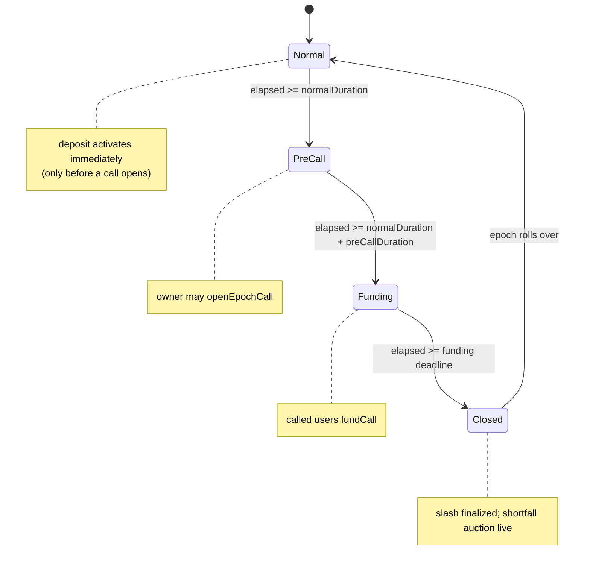
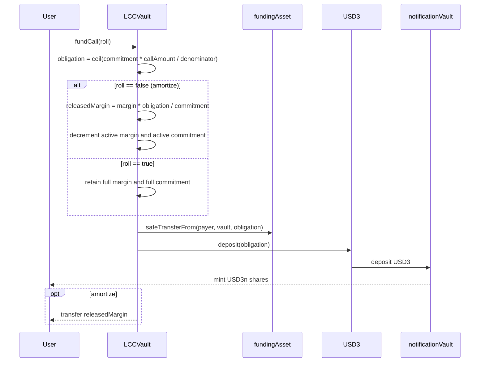
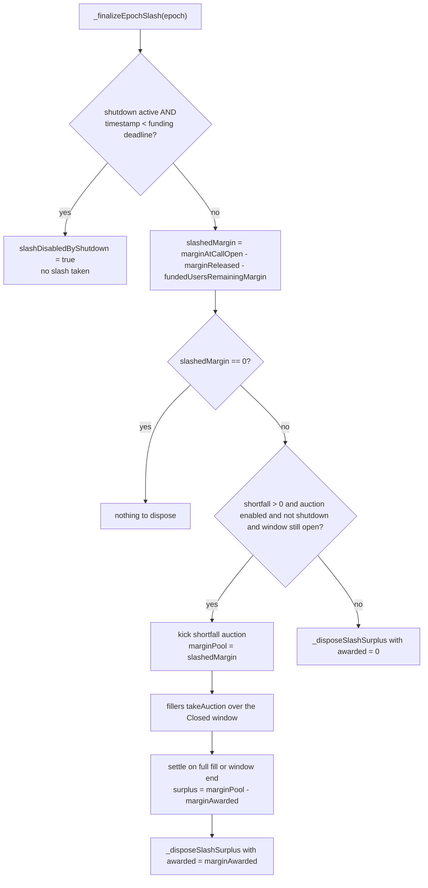
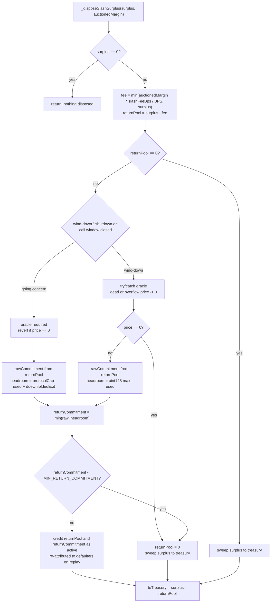
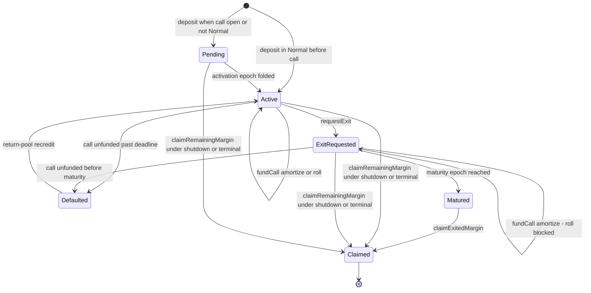
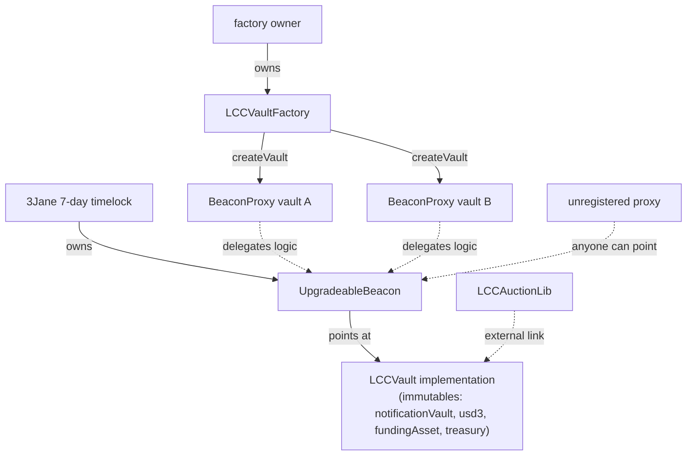

# LCC Vault — Leveraged Callable Credit

This is the mechanics deep-dive for the `src/lcc/` module, written for auditors. It teaches the epoch phases,
the funding and slashing flows, and the accounting invariants, with diagrams as the centerpiece. Every function,
field, and constant named here is a backticked identifier that resolves in the code. For the per-function API
contract read the NatSpec in [`interfaces/ILCCVault.sol`](interfaces/ILCCVault.sol); for the terse repo-wide map
and the upgrade checklist of record read [`docs/architecture.md`](../../docs/architecture.md).

## 1. What an LCC facility is

An LCC vault is a per-facility callable-credit primitive. It is **not** an ERC-4626 vault and it mints **no
transferable shares**. A depositor posts one ERC20 `marginAsset` as a performance bond. The vault values that bond
through a trusted oracle and leverages the value into a callable commitment denominated in `fundingAsset`:

```
marginValue = assets * price / ORACLE_PRICE_SCALE      // margin valued in fundingAsset
commitment  = marginValue * BPS / marginRatioBps       // leveraged callable commitment
```

`ORACLE_PRICE_SCALE` is `1e36` and `BPS` is `10_000`. With `marginRatioBps = 2000` the leverage is `BPS / 2000 = 5x`.

The vault owner opens at most one **capital call** per epoch. Each account with active commitment then owes a
ceil-rounded pro-rata slice of the call, funded **all-or-nothing** during the Funding phase; the funded amount is
delivered to the funder as wrapped USD3n (USDC routed through USD3 into the notification vault). An account that
does not meet its obligation by the funding deadline forfeits its **entire** margin under the slash, and the
resulting call shortfall is offered through a step-decay shortfall auction.

**Unit convention** (from the `ILCCVault` header). Amount-like accounting values outside the margin family are
denominated in `fundingAsset` unless documented otherwise. Margin amounts are in `marginAsset`. `marginValue` is
margin valued in `fundingAsset`. `*Bps` fields are basis points out of `BPS`. Epoch fields are epoch indices.

**Spec-vocabulary mapping.** The spec term "callable asset" maps to `fundingAsset` in code, because that token
funds calls and auction fills. The worked examples below use symbolic round numbers (in whole `fundingAsset` /
`marginAsset` units, i.e. scaled by each token's decimals), not raw base units.

## 2. File map

| File                             | Responsibility                                                            |
| -------------------------------- | ------------------------------------------------------------------------- |
| `LCCVault.sol`                   | The vault: clock, deposits, calls, funding, lazy sync, slash, auction     |
| `LCCVaultFactory.sol`            | Owner-gated `BeaconProxy` deployment + provenance registry                |
| `interfaces/ILCCVault.sol`       | External API, structs, and per-function NatSpec (the API reference)       |
| `libraries/LCCAuctionLib.sol`    | Stateless auction pricing math; externally linked into the implementation |
| `libraries/LCCConfigLib.sol`     | `initialize` parameter validation and derived auction step duration       |
| `libraries/LCCAccountLib.sol`    | Pure in-memory account transitions (activate, mature, default, clear)     |
| `libraries/LCCBucketListLib.sol` | Sparse epoch-keyed bucket lists with swap-remove and 1-based index maps   |
| `libraries/LCCTypesLib.sol`      | Packed storage structs (upgrade-frozen layout)                            |
| `libraries/LCCErrorsLib.sol`     | Error selectors                                                           |
| `libraries/LCCEventsLib.sol`     | Event definitions                                                         |

Test suite in `test/forge/lcc/` maps to mechanics: `LCCDeposit` (deposits, activation, caps), `LCCCall` (open
call), `LCCFunding` / `LCCRoll` (amortize vs roll), `LCCSlash` / `LCCSlashFee` (slash and fee clamp), `LCCAuction`
(auction takes) / `LCCAuctionLib` (pricing-math unit tests), `LCCReturnPool` (surplus disposal), `LCCExit` /
`LCCMinCommitment` (exits and the commitment gate), `LCCTerminal` / `LCCShutdown` (wind-down), `LCCMaterialize` /
`LCCSync` (lazy replay), `LCCInvariant` (stateful harness), `LCCProxy` / `LCCFactory` (deployment topology), all
over the shared `LCCBase` harness.

## 3. Actors and trust model

- **Owner** — fully trusted. Opens calls (`openEpochCall`), tunes mutable risk caps (`setRiskCaps`,
  `setMaxAuctionAwardBps`, `setSlashFeeBps`), and can trigger `shutdown`. The owner controls the call size; a
  dust-sized `callAmount` can force every account to owe a single funding unit (see §7), a documented owner surface.
- **Margin oracle** — fully trusted. Returns a fresh `marginAsset`-to-`fundingAsset` price scaled by
  `ORACLE_PRICE_SCALE`, absorbing any token-decimal conversion. A zero price reverts (`OraclePriceInvalid`).
- **Depositor / funder** — posts margin, funds its own obligation (`fundCall(bool)`), and exits (`requestExit`).
- **Push funder** — funds another account's obligation with `fundCall(address)`; always amortizes.
- **Auction filler** — fills an epoch's shortfall via `takeAuction` for wrapped USD3n plus a collateral kicker.
- **Treasury** — protocol-wide recipient of slashed margin and unsold auction collateral. Immutable.
- **Beacon owner** — 3Jane's 7-day timelock; can replace logic under every beacon-backed vault after the delay.

Operational requirements: the `marginAsset` must be a standard ERC20 (fee-on-transfer or rebasing tokens break
margin conservation), and each vault must be on USD3's `supplyCapExempt` list so funding and fill deposits bypass
supply-cap headroom and first-time minimums.

### Configuration parameters

Every `VaultParams` field is validated by `LCCConfigLib.validate` at `initialize`. Mutable fields are re-validated
by their own setter: `setRiskCaps` re-checks `protocolCommitmentCap`, `userCommitmentCap`, `exitCapBps`, and
`minDepositAssets`; `maxAuctionAwardBps` and `slashFeeBps` each have a dedicated setter (`setMaxAuctionAwardBps`,
`setSlashFeeBps`) with their own guards — both reject a nonzero value on an auction-disabled vault (`InvalidParams`)
and revert `InvalidPhase` while an auction is live.

| Field                     | Meaning                                                                  | Validation bound                                     |
| ------------------------- | ------------------------------------------------------------------------ | ---------------------------------------------------- |
| `owner`                   | Vault owner                                                              | non-zero                                             |
| `marginAsset`             | ERC20 performance bond                                                   | non-zero; must be standard ERC20                     |
| `marginOracle`            | Margin-to-funding price oracle                                           | non-zero                                             |
| `startTimestamp`          | Epoch-zero start                                                         | `<= type(uint64).max`                                |
| `maxEpochs`               | Callable epoch count; `0` = perpetual                                    | `<= type(uint64).max`                                |
| `epochLength`             | Total epoch seconds                                                      | non-zero; `<= type(uint32).max`                      |
| `normalDuration`          | Normal phase seconds                                                     | non-zero; `<= type(uint32).max`                      |
| `preCallDuration`         | PreCall phase seconds                                                    | non-zero; `<= type(uint32).max`                      |
| `fundingDuration`         | Funding phase seconds                                                    | non-zero; sum of three phases `<= epochLength`       |
| `marginRatioBps`          | Leverage: `commitment = marginValue * BPS / marginRatioBps`              | `> 0` and `<= BPS`                                   |
| `protocolCommitmentCap`   | Vault-wide active+pending commitment cap (mutable: setRiskCaps)          | `> 0` and `<= type(uint128).max`                     |
| `userCommitmentCap`       | Per-account commitment cap (mutable: setRiskCaps)                        | `> 0` (no width bound)                               |
| `exitCapBps`              | Per-epoch exit capacity fraction of the cap (mutable: setRiskCaps)       | `>= MIN_EXIT_CAP_BPS` (313) and `<= BPS`             |
| `exitDelayEpochs`         | Min epochs from request to earliest maturity                             | `> 0` and `<= 64` (`MAX_EXIT_DELAY_EPOCHS`)          |
| `minCommitmentEpochs`     | Min committed epochs before an exit request; `0` disables                | `<= 64`                                              |
| `minDepositAssets`        | Minimum margin deposit (mutable: setRiskCaps)                            | none (may be `0`)                                    |
| `auctionStepCount`        | Price steps across the Closed window; `0` disables auction               | `0`, or `>= 2` and `<= epochLength - phaseDurations` |
| `auctionStepDecayRateBps` | Per-step retained-pool decay                                             | if enabled: `> 0` and `<= BPS`; if disabled: `0`     |
| `maxAuctionAwardBps`      | Oracle-valued award cap per unit filled (mutable: setMaxAuctionAwardBps) | `<= BPS`; if auction disabled: `0`                   |
| `slashFeeBps`             | Fee on auction-awarded margin (mutable: setSlashFeeBps)                  | `<= BPS`; if auction disabled: `0`                   |

`MIN_EXIT_CAP_BPS` is `(2 * BPS + 63) / 64 = 313`; it floors `exitCapBps` so full-cap honest exit demand plus the
maximum temporal spread fits inside the 128 maturity-bucket cap (§9). When `auctionStepCount == 0` the disposal
path still runs, but no collateral is ever awarded, so a nonzero decay, award cap, or slash fee is dead config and
rejected. Only `protocolCommitmentCap` carries the `uint128` width bound; `validate` enforces just `> 0` on
`userCommitmentCap`, which is transitively bounded below `uint128` because no account's active+pending commitment
can exceed the protocol cap.

## 4. Epoch clock and phase machine

Phases are **pure functions of `block.timestamp`**. Nothing transitions them; no keeper advances them. `_currentEpoch`
clamps to `0` before `startTimestamp` (`if (block.timestamp < startTimestamp) return 0`) and is otherwise
`(block.timestamp - startTimestamp) / epochLength`, and `_phaseAt` maps the offset within the epoch to a `Phase`.
The `synced` modifier only catches **accounting** up to the wall clock (§5); it never changes which phase the clock
is in.



| Phase     | Ends at (`phaseEndsAt`)                                     | Phase-gated action                    | Revert if wrong phase |
| --------- | ----------------------------------------------------------- | ------------------------------------- | --------------------- |
| `Normal`  | `start + normalDuration`                                    | —                                     | —                     |
| `PreCall` | `start + normalDuration + preCallDuration`                  | `openEpochCall`                       | `InvalidPhase`        |
| `Funding` | `_fundingDeadline` (= `start + normal + preCall + funding`) | `fundCall(bool)`, `fundCall(address)` | `InvalidPhase`        |
| `Closed`  | `start + epochLength`                                       | `takeAuction` (auction must be live)  | `AuctionNotLive`      |

**Phase-free / lifecycle-gated entrypoints** (these have **no** phase check):

- `deposit(assets)` is callable in **any** phase. The phase only selects **immediate vs pending** activation:
  immediate only during `Normal` **and before a call has opened** for the current epoch, otherwise the deposit is
  pending for epoch `e+1`. Its gates are lifecycle, not phase: `ShutdownActive`, `VaultTerminal`, `InvalidAmount`
  (zero / below `minDepositAssets` / zero commitment), `ExitInProgress`, `OraclePriceInvalid`, `CapExceeded`.
- `requestExit()` has no phase check; it is gated by `VaultTerminal`, `ExitInProgress`, `PendingDepositExists`,
  `InvalidAmount` (no active position), `CommitmentNotMature`, and `ExitCapacityReached`.
- `claimExitedMargin` / `claimRemainingMargin` have no phase check; they are gated by maturity, shutdown/terminal,
  and materialization lifecycle conditions.

`openEpochCall` also requires the epoch to be current (`InvalidEpoch`), no prior unsettled call
(`PriorCallUnsettled`), not already opened (`CallAlreadyOpened`), and `callAmount <= activeCommitment`.

## 5. Keeperless lazy sync

Every state-touching entrypoint runs the `synced` modifier, which calls `_syncGlobal`. The ordering is
load-bearing:


1. `_settleDueAuction` sweeps a live auction whose Closed window has passed (or once shutdown blocks takes), so a
   prior epoch's auction always settles before a new one can be kicked. Settlement disposes the auction's unawarded
   remainder through `_disposeSlashSurplus`, and that disposal's return-pool credit **increases** active totals via
   `_increaseGlobalActive(returnPool, returnCommitment)` (the same disposal path as §8 / Diagram C2).
2. The slash prefix is finalized in `calledEpochList` order: `_finalizeEpochSlash` runs for each leading called
   epoch that is slash-eligible, advancing `finalizedCallPrefix`. It stops at the first non-eligible epoch.
3. `_foldDueActivations` folds pending deposits whose activation epoch has arrived into active totals.
4. `_foldDueMaturities` folds matured exit buckets out of active totals.

**Slash before maturity folds** is intentional: finalizing a slash carves defaulted exiter exposure out of the exit
buckets (`_reduceExitBucketsForSlash`) before those buckets decrement global active totals, so a defaulted exiter's
exposure leaves the totals exactly once. `_dueUnfoldedExitCommitment` — matured-but-unfolded exit commitment added
back into going-concern disposal headroom (§8) — relies on this ordering; reordering would double-count.

**Per-account replay.** Account state is materialized on demand by replaying the sparse `calledEpochList` from each
account's `calledEpochCursor` (`_replayAccount`). A mutating replay is bounded to `MAX_MATERIALIZE_STEPS = 64`
finalized calls per call; an account further behind reverts `AccountMaterializationIncomplete` until the
permissionless `materializeAccount` advances it in batches. Replay also stops at an unfinalized epoch or at the live
auction epoch (the live-auction replay barrier), so exposure under an in-flight auction is never prematurely
resolved.

## 6. Deposits and commitment

`deposit` pulls `assets` of `marginAsset` from the caller (self-deposit only — a deposit creates a callable
obligation), reads the oracle, and derives `commitment = marginValue * BPS / marginRatioBps`. Both caps are checked
against active+pending totals: `protocolCommitmentCap` vault-wide and `userCommitmentCap` per account
(`CapExceeded`).

Activation follows `_depositActivation`: **immediate** (credited to `activeMargin` / `activeCommitment` now) only
when the phase is `Normal` and no call has opened for the current epoch; otherwise **pending** for epoch `e+1`,
tracked in `pendingMarginByActivationEpoch` / `pendingCommitmentByActivationEpoch` and folded in later by sync.

Every deposit sets `commitmentStartEpoch` to its activation epoch — this restarts the `minCommitmentEpochs` exit
clock (§9). Funding of any kind never touches `commitmentStartEpoch`.

## 7. Capital calls and funding

`openEpochCall` (PreCall only) snapshots `commitmentDenominator = activeCommitment`, records `callAmount` and
`marginAtCallOpen`, pushes the epoch onto `calledEpochList`, and snapshots exit-bucket exposure for the call.

Each account's obligation is computed **independently** and **ceil-rounded** from the call-open snapshot:

```
obligation = ceil(activeCommitment * callAmount / commitmentDenominator)
```

Ceil rounding means the sum of obligations can exceed `callAmount` by up to `(number of funders - 1)` units of
dust. `callAmount` is the nominal pro-rata base, **not** a hard aggregate funding cap; the pool can settle slightly
above it. `obligationOf` returns `0` once the account has funded, the epoch is finalized, or no call is open.



**Amortize** (`fundCall(false)`): the account pays its obligation, releases margin proportionally
(`releasedMargin = activeMargin * obligation / activeCommitment`, floor), and its callable commitment drops by the
obligation. Active totals decrease. **Roll** (`fundCall(true)`): the account pays the obligation, receives wrapped
USD3n, but retains its **full** margin and **full** callable commitment; exposure re-arms every epoch, its pro-rata
share of later calls grows as amortizers decay, and lifetime obligations are unbounded. A live exiter cannot roll
(`ExitInProgress`) but may still amortize.

**Push funding** (`fundCall(address user)`): the caller pays; released margin, USD3n, and funded status accrue to
`user`. Push funding **always amortizes** so the payer cannot keep the user's margin locked. A push fund can
front-run and deny a user's intended roll for that epoch; the user can restore commitment by re-depositing the
released margin.

### Table 1 — one call/funding/slash scenario

`marginRatioBps = 2000` (5x), oracle price `1.0` (so `marginValue = margin`), `callAmount = 800`,
`commitmentDenominator = 8003`. Three accounts:

| Account | Margin | Commitment | Obligation (ceil)          | Action                                              |
| ------- | ------ | ---------- | -------------------------- | --------------------------------------------------- |
| Alice   | 1000   | 5000       | `ceil(4000000/8003)` = 500 | amortize → releases `1000*500/5000` = 100 margin    |
| Bob     | 600    | 3000       | `ceil(2400000/8003)` = 300 | roll → pays 300, keeps 600 margin / 3000 commitment |
| Carol   | 0.6    | 3          | `ceil(2400/8003)` = 1      | default → full margin slashed                       |

Carol's fair share is `3*800/8003 = 0.2999`, ceil-rounded up to `1` — the dust unit that makes the obligation sum
`500 + 300 + 1 = 801`, one unit above `callAmount = 800`.

Slash identity at finalization (Carol unfunded):

```
slashedMargin = marginAtCallOpen - marginReleased - fundedUsersRemainingMargin
              = 1600.6           - 100            - (900 + 600)
              = 0.6                                              // Carol's entire margin, all-or-nothing
```

`marginReleased = 100` (Alice's amortized release; Bob rolled, releasing nothing).
`fundedUsersRemainingMargin = 900 + 600` (Alice's post-release margin and Bob's retained margin).

## 8. Default, slashing, auction, disposal

`_finalizeEpochSlash` runs once per called epoch (lazily on sync, or via permissionless `finalizeEpochSlash`).
Diagram C1 covers the slash and auction kick; Diagram C2 covers surplus disposal at the `_disposeSlashSurplus`
boundary.



**Slash-disable boundary.** `_finalizeEpochSlash` disables slashing whenever
`_shutdown.active && _shutdown.timestamp < _fundingDeadline(epoch)` — i.e. **any** shutdown strictly **before** the
epoch's funding deadline, which **includes** a shutdown landing during `PreCall` after the call has already opened,
not only one inside the `Funding` phase. At or after the deadline, defaults are final. (Note the asymmetry:
`_slashEligible` uses `<=` the deadline for eligibility, but the disable check is strict `<`, so a shutdown exactly
at the deadline is eligible **and** its defaults stand.)

An auction is kicked only when there is a shortfall (`callAmount > fundedAmount`), `maxAuctionAwardBps != 0`, the
vault is not shut down, and the epoch-end window is still open. Otherwise the slashed margin flows straight to
`_disposeSlashSurplus` with `awarded = 0`.

### Auction pricing (Diagram D — formula + Table 2)

`takeAuction` follows Yearn-take semantics: `maxFillAmount` is the caller's only bound, filling
`min(maxFillAmount, remainingShortfall)`. The offered collateral ramps over the Closed window:

```
steps    = elapsed / stepDuration
retained = (1 - stepDecayRateBps/BPS) ^ steps        // rayMultiplier = RAY - stepDecayRateBps * 1e23
offered  = marginPool - marginPool * retained / RAY  // = marginPool * (1 - retained)
award    = min( offered * fill / shortfall,           // ramped pro-rata of the ORIGINAL shortfall
                fill * maxAuctionAwardBps/BPS * ORACLE_PRICE_SCALE/price,   // oracle-valued cap
                marginPool - marginAwarded )          // unawarded-pool clamp
```

**Table 2** — offered pool with `marginPool = 100`, `stepDecayRateBps = 1000` (retained factor `0.9` per step),
`auctionStepCount = 8`:

| Step | Retained `0.9^step` | Offered  | Live?                                                                                                |
| ---- | ------------------- | -------- | ---------------------------------------------------------------------------------------------------- |
| 0    | 1.0                 | 0        | yes (zero offer)                                                                                     |
| 1    | 0.9                 | 10       | yes                                                                                                  |
| 2    | 0.81                | 19       | yes                                                                                                  |
| 3    | 0.729               | 27.1     | yes                                                                                                  |
| 4    | 0.6561              | 34.39    | yes                                                                                                  |
| 5    | 0.59049             | 40.951   | yes                                                                                                  |
| 6    | 0.531441            | 46.8559  | yes                                                                                                  |
| 7    | 0.4782969           | 52.17031 | yes (max live offer in this example)                                                                 |
| 8    | 0.43046721          | 56.95328 | **no in this example — the window divides evenly, so the step-8 boundary coincides with settlement** |

The step index is `elapsed / auctionStepDuration`, uncapped, with `auctionStepDuration = closedWindow /
auctionStepCount` rounded down at configuration. When the Closed window divides evenly by the step count (as in this
table), takes are live strictly before epoch end, so reachable steps are `1..auctionStepCount-1` and the maximum live
offer is `marginPool * (1 - (1 - decay)^(auctionStepCount-1))`. When it does not divide evenly, the flooring leaves a
remainder at the end of the window, so steps at and beyond `auctionStepCount` can be live before epoch end and the
offer keeps ramping along the same curve (a 10-second window with 6 steps gives 1-second steps and live steps up to
9). A one-step auction would offer zero for its entire window, which is why `auctionStepCount >= 2` is enforced. When
`maxAuctionAwardBps` binds, the oracle cap (row-independent) caps the award below the ramped offer regardless of how
far the curve has advanced.

### Surplus disposal (Diagram C2)



The **fee is an auction rake**: `fee = min(auctionedMargin * slashFeeBps / BPS, surplus)`. Never-auctioned disposal
paths always pass `auctionedMargin = 0`, so `fee = 0` there. The remaining `returnPool` is valued into a
`returnCommitment` and re-attributed to defaulters as active margin/commitment; the rest goes to treasury.

**Going concern vs wind-down.** Going-concern disposal requires a live oracle (reverts `OraclePriceInvalid` on a
zero price) and clamps `returnCommitment` by real cap headroom
(`protocolCommitmentCap - used + dueUnfoldedExitCommitment`, where `used = active + pending commitment`). Wind-down
disposal — under `shutdown` or once `_callWindowClosed()` — wraps the oracle in try/catch, treats a dead or
overflow-risk price as zero (sweeping the pool to treasury rather than bricking), and clamps by the packed-totals
width (`type(uint128).max - used`) instead of the protocol cap, because no future call can ever use the returned
commitment. If the clamped `returnCommitment` falls below `MIN_RETURN_COMMITMENT` (`1e6` funding base units, i.e.
`1.0` unit of a 6-decimal `fundingAsset`), it is swept to treasury as dust.

Two subtleties carried in prose, not boxes:

- **Headroom add-back.** Going-concern headroom adds `_dueUnfoldedExitCommitment(currentEpoch)` — exit commitment
  that has matured but not yet folded out of `_totals`, so it would otherwise overstate `used`. This never
  double-counts because on the sync path disposal runs before `_foldDueMaturities`, and on a mid-window full-fill
  settlement it runs after that transaction's folds (where due buckets are already zeroed), summing `0`.
- **Tight-cap diversion.** When protocol-cap headroom binds, removing the slash fee does **not** increase defaulter
  recovery — the cap clamp diverts the excess to treasury anyway. Heavy rolling pins utilization and worsens this;
  owners manage it with `setRiskCaps`.

### Table 3 — disposal split

`slashedMargin` pool `= 100`, partial auction fill with `marginAwarded = 40`, disposed `surplus = 60`,
`slashFeeBps = 500` (5%), oracle price `1.0`, `marginRatioBps = 2000` (so `rawCommitment = returnPool * 5`).
`fee = min(40 * 500/10000, 60) = min(2, 60) = 2`, pre-clamp `returnPool = 58`, `rawCommitment = 290`.

| Headroom scenario               | returnCommitment | returnPool          | toTreasury               |
| ------------------------------- | ---------------- | ------------------- | ------------------------ |
| Headroom `>= 290` (no clamp)    | 290              | 58                  | `60 - 58` = 2 (fee only) |
| Headroom `= 100` (clamp)        | 100              | `58 * 100/290` = 20 | `60 - 20` = 40           |
| Dust (`returnCommitment < 1e6`) | 0 (swept)        | 0                   | 60 (entire surplus)      |

## 9. Exits

Exits are **full-account** and **irrevocable**. `requestExit` moves the whole active position into a maturity
bucket and assigns a maturity epoch, but the account **stays callable and slashable until maturity**.



**Commitment gate.** `requestExit` reverts `CommitmentNotMature` while
`currentEpoch < commitmentStartEpoch + minCommitmentEpochs`. The clock is anchored at the account's **latest**
deposit activation; every deposit resets it, and no funding touches it.

**Maturity assignment.** `_assignExitMaturity` is first-fit by request time (not strict FIFO): it starts at
`currentEpoch + exitDelayEpochs` and walks forward to the first bucket with room, where per-epoch capacity is
`protocolCommitmentCap * exitCapBps / BPS`. Funded or slashed amounts free bucket room retroactively. A request
larger than the whole per-epoch capacity takes the first bucket with any remaining room.

**Bucket-cap trio.** Live maturity buckets are hard-capped at `MAX_EXIT_MATURITY_BUCKETS = 2 * 64 = 128`; a request
that would create a 129th bucket reverts `ExitCapacityReached`. `exitDelayEpochs <= 64` and `exitCapBps >= 313`
(`MIN_EXIT_CAP_BPS`) are enforced at config so worst-case honest exit demand — including first-fit fragmentation —
stays within 128 and every bucket scan is gas-bounded.

**Lockup arithmetic.** With `minCommitmentEpochs = 4`, `exitDelayEpochs = 2`, and a deposit activating at epoch `3`:

```
earliest request  = commitmentStartEpoch + minCommitmentEpochs = 3 + 4 = 7
earliest maturity  = requestEpoch + exitDelayEpochs             = 7 + 2 = 9   (later if the bucket is full; first-fit)
```

`claimExitedMargin` pays the matured margin. A **fully-funded exiter** matures with nothing claimable but must
still call `claimExitedMargin` to clear the exit and make the account reusable (`clearExit`); otherwise it stays
`exitRequested` forever and can neither deposit nor re-exit.

## 10. Wind-down

Two independent wind-down triggers, both routed through the oracle-tolerant disposal path of §8.

**Emergency shutdown.** `shutdown` (owner-only) records `_shutdown` **before** its internal `_syncGlobal`, so
in-flight finalizations observe it. Its slash effect is the corrected boundary of §8: an epoch whose funding
deadline has **not** yet passed at the shutdown timestamp finalizes with slashing **disabled**
(`slashDisabledByShutdown`), so no margin is forfeited for calls that were still fundable when the vault froze;
epochs already past their deadline slash normally. Shutdown blocks new `deposit`, `openEpochCall`, and `takeAuction`,
and enables `claimRemainingMargin`.

**Scheduled sunset.** When `maxEpochs != 0`, epochs `0..maxEpochs-1` are callable and epoch `maxEpochs` begins a
terminal withdraw-only phase (`_terminal()`). `deposit`, `requestExit`, and `openEpochCall` revert `VaultTerminal`.
`_callWindowClosed()` — true once the last callable epoch's PreCall window has elapsed — flips disposal into the
oracle-tolerant, saturating-headroom mode even before the terminal boundary, since no returned commitment can ever
back a future call.

**`claimRemainingMargin`** is the wind-down claim: under shutdown or terminal it pays out active margin, pending
margin, and already-matured claimable exit margin, bypassing the maturity and `minCommitmentEpochs` gates that
`claimExitedMargin` enforces. A lagging account may need `materializeAccount` batches first (§5).

## 11. Deployment and upgrade topology



`LCCAuctionLib` is externally linked into a shared `LCCVault` implementation. An `UpgradeableBeacon` owned by the
7-day timelock points at that implementation; the implementation constructor fixes protocol-wide `notificationVault`,
`usd3`, `fundingAsset`, and `treasury` and calls `_disableInitializers()`. `LCCVaultFactory` deploys per-facility
`BeaconProxy` instances with atomic `initialize` calldata; per-facility params live in proxy storage. The factory
registry (`isVault` / `allVaults`) records owner-vetted **provenance only** — the beacon is public, so anyone can
point an unregistered proxy at it. Packed structs in `LCCTypesLib` are upgrade-frozen layout; new state must consume
`__gap`; `LCCAuctionLib` must be re-linked on every implementation redeploy; a `forge inspect LCCVault
storageLayout` diff is the manual review gate. The full upgrade checklist of record lives in
[`docs/architecture.md`](../../docs/architecture.md).

## 12. Known sharp edges / reviewer invariants

- **Margin conservation** assumes a standard ERC20 `marginAsset`; fee-on-transfer or rebasing breaks it.
- **Obligation-sum dust.** Per-account ceil rounding lets `fundedAmount` exceed `callAmount` by up to
  `(funders - 1)` units; `callAmount` is a nominal base, not a hard cap.
- **Dust calls are a slash lever.** A dust-sized `callAmount` forces every account to owe `1` unit; any non-funder
  forfeits its full margin under all-or-nothing slashing.
- **Rolling is not exiting.** Rolled accounts keep full callable commitment and re-arm every epoch; lifetime
  obligations while rolling are unbounded.
- **Rolling pins cap utilization.** Rolled accounts never decrement active commitment, shrinking deposit headroom
  and diverting more defaulter surplus to treasury via the going-concern clamp in tight-cap vaults.
- **Push funding front-runs rolls.** `fundCall(address)` always amortizes and can deny a user's intended roll for
  that epoch.
- **Slash-disable is strict-before-deadline.** Shutdown strictly before an epoch's funding deadline disables its
  slash (including during PreCall after the call opened); at/after the deadline defaults are final.
- **Fee is an auction rake.** Non-auctioned disposal paths carry `marginAwarded = 0`, so the slash fee is `0` there.
- **Going-concern disposal can revert.** Any going-concern disposal with a nonzero return pool (the surplus left
  after the fee) and a dead oracle (`price == 0`) reverts `OraclePriceInvalid` until the oracle recovers — this is
  independent of the fee, so zero-fee configs revert too; wind-down disposal is oracle-free.
- **Dead-oracle wind-down sweep.** A dead or overflow-risk price during wind-down sends the return pool to treasury
  rather than bricking the claim.
- **`MIN_RETURN_COMMITMENT` dust sweep.** A return commitment below `1e6` funding base units is zeroed and its pool
  swept to treasury.
- **Single live-auction slot.** Only one epoch's auction is live at a time; sync settles the prior before kicking a
  new one, and replay halts at the live-auction epoch.
- **Bounded replay barrier.** Accounts more than `MAX_MATERIALIZE_STEPS = 64` finalized calls behind revert
  `AccountMaterializationIncomplete` until `materializeAccount` advances them.
- **Exiters stay liable.** An exiting account remains callable and slashable until maturity; it may amortize but
  cannot roll (`ExitInProgress`). A fully-funded exiter must still call `claimExitedMargin` to free the account.
- **Cap changes do not unwind.** `setRiskCaps` lowering caps below current utilization does not force existing
  positions or assigned exit buckets to unwind.

## Related docs

- [`interfaces/ILCCVault.sol`](interfaces/ILCCVault.sol) — per-function API reference (NatSpec).
- [`docs/architecture.md`](../../docs/architecture.md) — terse repo-wide map and the upgrade checklist of record.
- This README — the mechanics deep-dive.
