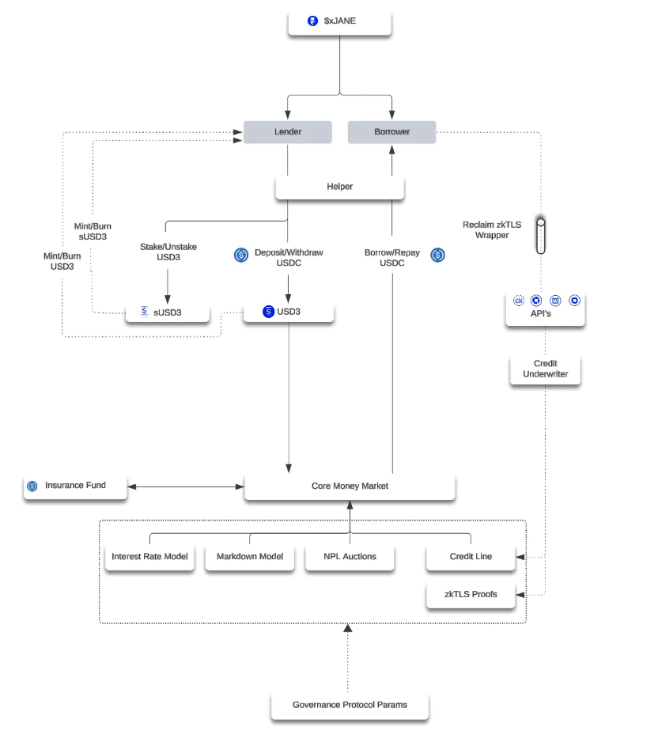

# 3Jane Protocol - Smart Contract Audit Scope

## Executive Summary

3Jane is a credit-based lending protocol built on top of Aave and Morpho Blue that provides asset-backed credit lines with dynamic risk-based pricing. The protocol consists of two main repositories: `morpho-blue` (credit infrastructure) and `usd3` (tranched yield strategies).

## Protocol Overview

### High-Level Architecture

3Jane operates as a three-tier system:
1. **Base Layer**: Aave V3 for stable yield generation
2. **Credit Layer**: Morpho Blue with custom credit scoring and risk management
3. **Tranche Layer**: USD3/sUSD3 strategies for capital efficiency and risk distribution

### Core Value Proposition

- **Asset-Backed Credit**: Users can borrow against their verified assets (bank accounts, crypto holdings, etc.)
- **Dynamic Risk Pricing**: Interest rates are calculated based on individual credit scores using a Dynamic Risk-Based Pricing (DRP) model
- **Tranched Capital Structure**: Senior (USD3) and junior (sUSD3) tranches for optimal capital allocation
- **Non-Custodial**: Users maintain control of their assets while accessing credit

## Technical Components

### 1. USD3 (Senior Tranche Strategy)

**Location**: `usd3/src/USD3.sol`

**Purpose**: Senior tranche strategy that provides stable yield with capital protection through sUSD3 subordination.

**Key Features**:
- **Morpho Blue Integration**: Deploys capital into Morpho Blue markets for lending
- **Ratio Management**: Enforces minimum USD3/sUSD3 ratios (default: 80% USD3, 20% sUSD3)
- **Credit Line Integration**: Connected to MorphoCredit for borrower risk management
- **Yield Sharing**: Shares interest with sUSD3 holders (configurable basis points)
- **Whitelist Controls**: Optional access controls for depositors
- **Commitment Periods**: Optional minimum deposit lock periods

**Critical Functions**:
- `_deployFunds()`: Supplies capital to Morpho Blue markets
- `_freeFunds()`: Withdraws capital from Morpho Blue markets
- `setUsd3MinRatio()`: Updates minimum USD3 ratio (admin only)
- `setSusd3Strategy()`: Links to sUSD3 strategy (admin only)

**Risk Considerations**:
- Morpho Blue market risk and liquidity constraints
- Credit line default risk (mitigated by sUSD3 subordination)
- Interest rate volatility in underlying markets
- Admin privilege risks for ratio and strategy updates

### 2. sUSD3 (Junior Tranche Strategy)

**Location**: `usd3/src/sUSD3.sol`

**Purpose**: Junior tranche strategy that absorbs first losses and provides levered yield opportunities.

**Key Features**:
- **First-Loss Protection**: Absorbs losses before USD3 holders
- **Lock Periods**: 90-day initial lock for new deposits
- **Cooldown System**: 7-day cooldown + 2-day withdrawal window
- **Subordination Ratio**: Maximum 15% of total capital structure
- **Yield Accumulation**: Tracks yield received from USD3 strategy
- **Loss Tracking**: Monitors total losses absorbed by the tranche

**Critical Functions**:
- `deposit()` / `mint()`: Override base functions to track lock periods
- `startCooldown()`: Initiates withdrawal process
- `withdraw()`: Enforces cooldown and window restrictions
- `_harvestAndReport()`: Accounts for yield and losses

**Risk Considerations**:
- First-loss position means higher risk of capital loss
- Lock periods create liquidity constraints
- Cooldown system complexity and potential for user errors
- Subordination ratio enforcement and its impact on capital efficiency

### 3. MorphoCredit (Credit Infrastructure)

**Location**: `morpho-blue/src/MorphoCredit.sol`

**Purpose**: Extends Morpho Blue with credit-based lending, per-borrower risk premiums, and delinquency management.

**Key Features**:
- **Three-Tier Interest System**:
  1. Base Rate: Market-wide rate from IRM
  2. Premium Rate: Per-borrower risk premium
  3. Penalty Rate: Additional rate for delinquent borrowers
- **Premium Accrual**: Continuous premium calculation based on credit scores
- **Payment Cycles**: Structured repayment obligations
- **Markdown System**: Dynamic debt value reduction for defaulted positions
- **Delinquency Management**: Grace periods and penalty rate application

**Critical Functions**:
- `accrueBorrowerPremium()`: Calculates and applies borrower-specific premiums
- `_calculateBorrowerPremiumAmount()`: Premium calculation logic
- `_updateBorrowerMarkdown()`: Updates markdown state for defaulted borrowers
- `setCreditLine()`: Sets borrower credit limits and premium rates

**Risk Considerations**:
- Premium calculation precision and overflow risks
- Markdown system complexity and potential for manipulation
- Delinquency detection and penalty rate application
- Integration with external credit scoring systems

### 4. ProtocolConfig (Configuration Management)

**Location**: `morpho-blue/src/ProtocolConfig.sol`

**Purpose**: Centralized configuration management for all protocol parameters.

**Key Features**:
- **Credit Line Config**: LTV limits, credit line bounds, DRP limits
- **Market Config**: Grace periods, delinquency periods, minimum borrow amounts
- **IRM Config**: Interest rate model parameters
- **Tranche Config**: USD3/sUSD3 ratios and lock durations
- **Admin Controls**: Owner-only parameter updates

**Critical Functions**:
- `setConfig()`: Updates any configuration parameter (owner only)
- `getCreditLineConfig()`: Returns credit line parameters
- `getMarketConfig()`: Returns market parameters
- `getIRMConfig()`: Returns interest rate model parameters

**Risk Considerations**:
- Single point of failure for all protocol parameters
- Owner privilege risks and potential for misconfiguration
- Parameter validation and bounds checking
- Upgrade path and governance considerations

### 5. CreditLine (Credit Line Management)

**Location**: `morpho-blue/src/CreditLine.sol`

**Purpose**: Manages credit line creation, validation, and configuration for individual borrowers.

**Key Features**:
- **Credit Line Validation**: Enforces protocol limits and constraints
- **External Verification**: Optional prover integration for additional validation
- **OZD Integration**: Integration with external credit scoring system
- **Parameter Bounds**: Validates LTV, credit amounts, and premium rates

**Critical Functions**:
- `setCreditLine()`: Creates or updates borrower credit lines
- `setOzd()` / `setProver()`: Updates external system addresses
- Validation logic for credit line parameters

**Risk Considerations**:
- Credit line parameter validation and bounds checking
- External system integration risks (OZD, prover)
- Authorization controls and access management
- Credit line manipulation and fraud prevention

### 6. Interest Rate Module (IRM)

**Location**: `morpho-blue/src/irm/adaptive-curve-irm/AdaptiveCurveIrm.sol`

**Purpose**: Implements adaptive interest rate curves that respond to market utilization.

**Key Features**:
- **Adaptive Curves**: Interest rates adjust based on market utilization
- **Target Utilization**: Protocol-defined optimal utilization rate
- **Rate Bounds**: Minimum and maximum rate constraints
- **Exponential Adaptation**: Smooth rate transitions over time

**Critical Functions**:
- `borrowRate()`: Calculates current borrow rate
- `_borrowRate()`: Internal rate calculation logic
- `_curve()`: Implements the interest rate curve formula
- `_newRateAtTarget()`: Calculates new target rates

**Risk Considerations**:
- Rate calculation precision and mathematical accuracy
- Utilization manipulation and gaming potential
- Rate bounds enforcement and edge cases
- Integration with MorphoCredit premium system

### 7. MarkdownManager (Debt Valuation)

**Location**: `morpho-blue/src/MarkdownManager.sol`

**Purpose**: Manages debt markdown calculations for defaulted positions.

**Key Features**:
- **Markdown Calculation**: Reduces debt value based on time in default
- **Multiplier System**: Time-based value reduction multipliers
- **Default Tracking**: Monitors borrower default status and duration

**Critical Functions**:
- `calculateMarkdown()`: Calculates markdown amount for defaulted debt
- `getMarkdownMultiplier()`: Returns value multiplier based on default duration

**Risk Considerations**:
- Markdown calculation accuracy and fairness
- Time-based multiplier system design
- Integration with MorphoCredit delinquency system
- Impact on sUSD3 loss absorption

### 8. Helper (Integration Layer)

**Location**: `morpho-blue/src/Helper.sol`

**Purpose**: Provides convenient integration functions for users to interact with the protocol.

**Key Features**:
- **Aave Integration**: Handles USDC to aUSDC conversions
- **USD3/sUSD3 Integration**: Manages tranche deposits and redemptions
- **Morpho Integration**: Handles borrowing and repayment operations
- **Token Approvals**: Manages all necessary token approvals

**Critical Functions**:
- `deposit()`: Deposits USDC and optionally converts to sUSD3
- `redeem()`: Redeems USD3 shares for USDC
- `borrow()`: Borrows from Morpho with automatic unwrapping
- `repay()`: Repays Morpho debt with automatic wrapping

**Risk Considerations**:
- Token approval management and security
- Integration complexity and potential for user errors
- Gas optimization and transaction efficiency
- Error handling and user experience

## Audit Scope

### In Scope Contracts

**USD3 Repository**:
- `USD3.sol` - Senior tranche strategy
- `sUSD3.sol` - Junior tranche strategy
- `BaseStrategyUpgradeable.sol` - Base strategy implementation
- All interfaces and dependencies

**Morpho Blue Repository**:
- `MorphoCredit.sol` - Credit infrastructure
- `ProtocolConfig.sol` - Configuration management
- `CreditLine.sol` - Credit line management
- `MarkdownManager.sol` - Debt markdown system
- `Helper.sol` - Integration layer
- `AdaptiveCurveIrm.sol` - Interest rate model
- All interfaces and libraries

### Out of Scope

- External dependencies (Aave V3, Morpho Blue core)
- Frontend applications and user interfaces
- Off-chain credit scoring systems
- Governance and DAO contracts (if any)
- Third-party integrations (OZD, prover systems)

## Key Risk Areas

### 1. Credit Risk Management
- Credit line validation and enforcement
- Premium calculation accuracy and overflow protection
- Delinquency detection and penalty application
- Markdown system fairness and manipulation resistance

### 2. Capital Structure Risk
- USD3/sUSD3 ratio enforcement and manipulation
- First-loss absorption mechanics in sUSD3
- Lock period and cooldown system integrity
- Subordination ratio maintenance

### 3. Interest Rate Risk
- IRM calculation accuracy and mathematical soundness
- Premium rate integration with base rates
- Rate bounds enforcement and edge cases
- Utilization manipulation resistance

### 4. Integration Risk
- Morpho Blue market integration and liquidity constraints
- Aave V3 integration and yield generation
- External system dependencies (OZD, prover)
- Token approval and transfer security

### 5. Admin and Governance Risk
- ProtocolConfig parameter management
- Upgrade mechanisms and proxy patterns
- Owner privilege controls and access management
- Emergency shutdown procedures

### 6. Mathematical and Precision Risk
- Premium calculation precision and rounding
- Share calculation accuracy in tranche strategies
- Interest accrual and compounding mechanics
- Markdown calculation fairness

## Testing Recommendations

1. **Credit Line Scenarios**: Test various credit scores, asset values, and premium rates
2. **Delinquency Flows**: Test grace periods, penalty rates, and markdown calculations
3. **Tranche Mechanics**: Test USD3/sUSD3 ratio enforcement and loss absorption
4. **Interest Rate Scenarios**: Test IRM under various utilization levels
5. **Integration Tests**: Test full user flows from deposit to borrowing
6. **Edge Cases**: Test boundary conditions and extreme parameter values
7. **Stress Tests**: Test protocol behavior under high utilization and default scenarios

## Conclusion

The 3Jane protocol represents a sophisticated credit-based lending system that combines traditional credit scoring with DeFi mechanics. The audit should focus on the mathematical accuracy of risk calculations, the integrity of the tranche structure, and the security of external integrations. Special attention should be paid to the premium calculation system, markdown mechanics, and the interaction between the various protocol components. 